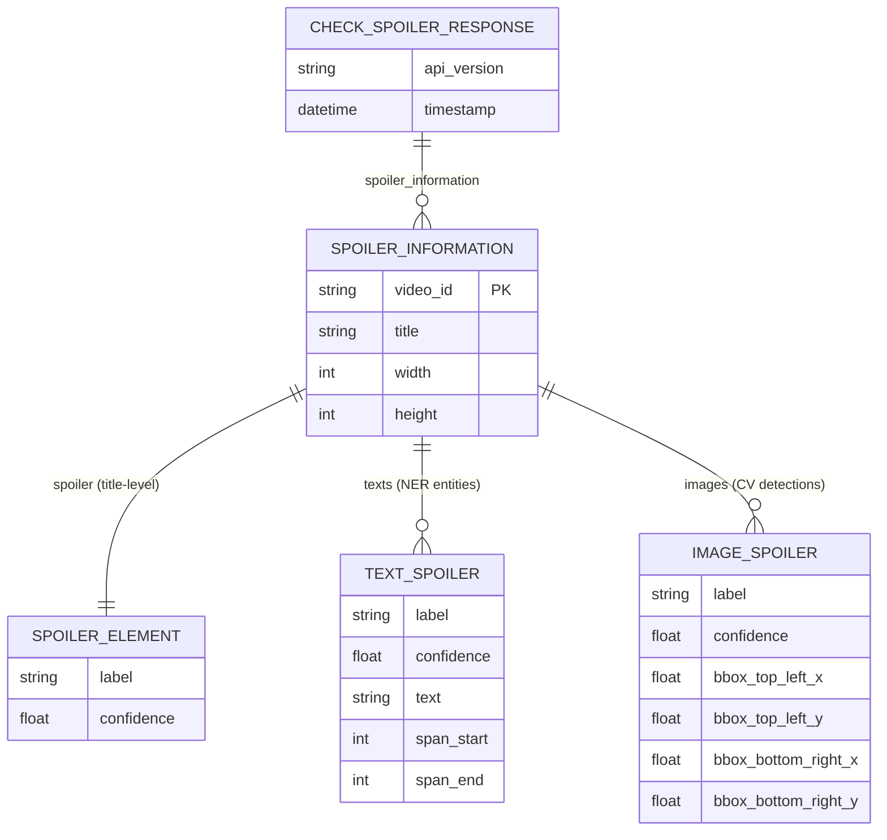
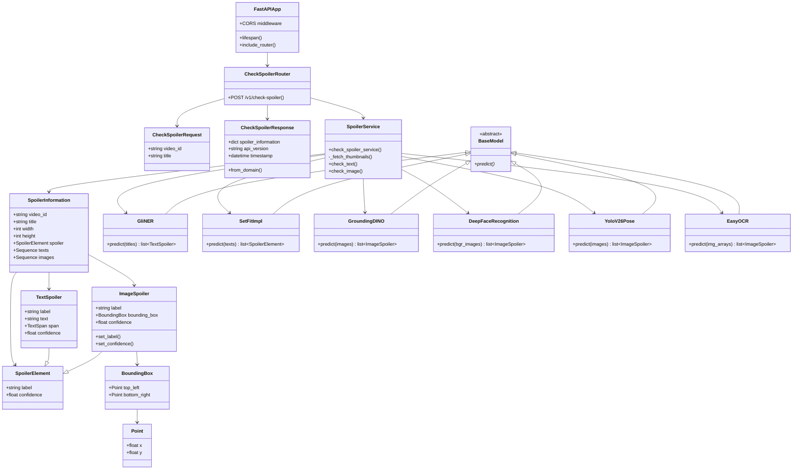

# 📝 Project: Sports Spoiler Detector

> ML API that automatically detects spoilers in YouTube sports video titles and thumbnails

**Languages:** [English](./README.en.md) · [한국어](./README.md)

---

## 📑 Table of Contents

1. [Project Overview](#-project-overview)
2. [Tech Stack](#-tech-stack)
3. [Key Features](#-key-features)
4. [API Reference](#-api-reference)
5. [System Architecture](#-system-architecture)
6. [Domain Model Diagram](#-domain-model-diagram)
7. [Class Diagram](#-class-diagram)
8. [Getting Started (Local Setup)](#-getting-started-local-setup)
9. [Environment Variables](#-environment-variables)
10. [Deployment](#-deployment)
11. [Team](#-team)
12. [License](#️-license)

---

## 🚀 Project Overview

* **Development Period**: 2026 Capstone Design
* **Core Value**: Protect the viewing experience by detecting spoilers hidden in titles and thumbnails before users watch sports videos on YouTube.
* **Service URL**: [https://www.sportspoilerdetector.kro.kr](https://www.sportspoilerdetector.kro.kr)
* **Integration Target**: Chrome Extension (CORS allowed for `chrome-extension://*`)

---

## 🛠 Tech Stack

### Backend

* **Language**: Python 3.12+
* **Framework**: FastAPI, Uvicorn
* **Validation**: Pydantic v2
* **HTTP Client**: httpx (async YouTube thumbnail fetch)
* **Package Manager**: uv (`uv.lock`)

### Machine Learning

| Module | Model | Purpose |
| --- | --- | --- |
| **NER** | GLiNER2 (DeBERTa-v3-base) | Extract sports entities from titles |
| **Text Classifier** | SetFit + `paraphrase-multilingual-mpnet-base-v2` | 3-class: Direct / Indirect / Non-Spoiler |
| **Object Detector** | Grounding DINO Tiny | Zero-shot detection of trophies, balls, goal nets, etc. |
| **Emotion Recognition** | DeepFace | Facial emotion analysis on thumbnails |
| **Pose Detector** | YOLOv26n-pose | Celebration pose detection |
| **OCR** | EasyOCR | Overlay text extraction from thumbnails (en/ko) |

* **Deep Learning Runtime**: PyTorch (auto-selects CUDA → MPS → CPU)

### Infrastructure & DevOps

* **Server**: AWS EC2
* **Container**: Docker, Docker Compose
* **CI/CD**: GitHub Actions
* **Proxy / SSL**: Nginx, Let's Encrypt (Certbot)
* **Registry**: Docker Hub (`seonghun120614/sports-spoiler-detector`)

---

## ✨ Key Features

* **Batch spoiler detection**: Process an array of YouTube `video_id` + `title` pairs in a single API call
* **Automatic thumbnail fetch**: Retrieves thumbnails from `img.youtube.com/vi/{video_id}/mqdefault.jpg`
* **Text analysis pipeline**
  * Classify spoiler level with SetFit on title + OCR-extracted text
  * Extract 9 types of sports entities from titles with GLiNER NER (win/loss, scoring, special events, etc.)
* **Image analysis pipeline** (parallel batch processing)
  * Grounding DINO: Detect spoiler-related objects (trophy, ball, goal net)
  * DeepFace: Player/spectator facial emotions (happy, surprise, neutral, etc.)
  * YOLO Pose: Celebration poses (arms spread + knee sliding)
  * EasyOCR: Extract overlay text from thumbnails and feed into the text classifier
* **Chrome Extension integration**: CORS configured for Chrome Extension origins
* **Mock mode**: Returns test mock responses when `TEST_FLAG` is set or model loading fails
* **GPU acceleration**: NVIDIA GPU support in production (Docker Compose)

### NER Entity Types

| Entity | Description |
| --- | --- |
| `success` | Positive match outcomes (victory, advancement, etc.) |
| `failure` | Negative match outcomes (defeat, elimination, etc.) |
| `draw` | Draw / tie |
| `round` | Tournament rounds (Round of 32, final, etc.) |
| `name` | Player or manager names |
| `scoring_text` | Scoring-related expressions (goals, hat-tricks, saves, etc.) |
| `special_event` | Game-changing events (red cards, penalties, injuries, etc.) |
| `emotive` | Emotional modifiers (shocking, miraculous, etc.) |
| `aftermath` | Post-match consequences (dismissal, retirement, etc.) |

### Spoiler Classification Labels

* `Direct Spoiler` — Match outcome is directly revealed
* `Indirect Spoiler` — Indirect clues that allow inferring the outcome
* `Non-Spoiler` — No spoiler elements

---

## 📝 API Reference

| Name | Type | Status | URL | Body | Description |
| --- | --- | --- | --- | --- | --- |
| Health Check | GET | 200 | `/` | - | Check API status. Returns `{"status": "healthy", "message": "Sports Spoiler Detector API"}` |
| Spoiler Check | POST | 200 | `/v1/check-spoiler` | `CheckSpoilerRequest[]` | Detect spoilers from YouTube video IDs + titles in batch |

#### Request Body — `CheckSpoilerRequest[]`

```json
[
  {
    "video_id": "UXZPxz6H_kU",
    "title": "[3-min Highlights] Round of 32 Spain VS Austria"
  }
]
```

| Field | Type | Constraints | Description |
| --- | --- | --- | --- |
| `video_id` | `string` | Regex `^[a-zA-Z0-9_-]{11}$` | YouTube video ID (11 characters) |
| `title` | `string` | `min_length=1`, extra fields forbidden | Video title |

#### Response — `CheckSpoilerResponse`

```json
{
  "spoiler_information": {
    "UXZPxz6H_kU": {
      "video_id": "UXZPxz6H_kU",
      "title": "[3-min Highlights] Round of 32 Spain VS Austria",
      "width": 320,
      "height": 180,
      "spoiler": {
        "label": "Direct Spoiler",
        "confidence": 0.896
      },
      "texts": [
        {
          "label": "name",
          "confidence": 0.999,
          "text": "Round of 32 Spain",
          "span": { "start": 11, "end": 18 }
        }
      ],
      "images": [
        {
          "label": "happy",
          "confidence": 0.86,
          "bounding_box": {
            "top_left": { "x": 0, "y": 0 },
            "bottom_right": { "x": 319, "y": 179 }
          }
        }
      ]
    }
  },
  "api_version": "v1",
  "timestamp": "2026-07-04T22:00:31.380540"
}
```

| Field | Type | Description |
| --- | --- | --- |
| `spoiler_information` | `dict[string, SpoilerInformation]` | Mapping of video_id → analysis result |
| `spoiler` | `SpoilerElement` | Title-level spoiler classification |
| `texts` | `TextSpoiler[]` | NER-extracted entities from the title |
| `images` | `ImageSpoiler[]` | Combined object, emotion, pose, and OCR detections |
| `api_version` | `string` | API version (default `"v1"`) |
| `timestamp` | `datetime` | Response generation timestamp |

#### Special Behavior

* **Empty array request** → Returns `[]`
* **`TEST_FLAG` environment variable set** → Returns mock data (testable without loading models)

---

## 🏗 System Architecture

This project uses **Nginx as a reverse proxy** and **SSL termination**, running a **FastAPI ML API** in isolated Docker Compose containers. It operates **statelessly without a database**.

#### 1. External Request Flow (Traffic Flow)

* **Single HTTPS entry point**: Users (Chrome Extension) access the API via **port 443 (HTTPS)**. HTTP (80) redirects to HTTPS.
* **Proxy routing**:
  * All API requests → Nginx → **Backend (FastAPI, port 8000)**
  * Let's Encrypt certificate renewal → Certbot (ACME challenge)

#### 2. Container Architecture

| Container | Role | Port |
| --- | --- | --- |
| **app** | FastAPI + ML model inference (GPU support) | 8000 (internal) |
| **nginx** | SSL reverse proxy | 80, 443 (external) |
| **certbot** | Automatic Let's Encrypt certificate renewal | - |

* **app**: `./static` volume mount (ML model weights, read-only), built-in healthcheck
* **GPU**: NVIDIA driver + `capabilities: [gpu]` configuration

#### 3. ML Inference Pipeline

```
Chrome Extension
    │
    ▼ POST /v1/check-spoiler
  Nginx (443)
    │
    ▼
  FastAPI App
    │
    ├─► YouTube CDN ──► Thumbnail fetch (httpx)
    │
    ├─► EasyOCR ──► Overlay text extraction
    │
    ├─► SetFit ──► Spoiler classification (title + OCR text)
    ├─► GLiNER ──► NER entity extraction (title)
    │
    ├─► Grounding DINO ──► Object detection (trophy, ball, goal net)
    ├─► YOLO Pose ──► Celebration pose detection
    └─► DeepFace ──► Facial emotion analysis
    │
    ▼
  CheckSpoilerResponse JSON
```

#### 4. Deployment Pipeline (CI/CD)

* Push to `main` → GitHub Actions triggered
* Docker multi-stage build → Push to Docker Hub (`:{git_sha}`, `:latest`)
* SCP `docker-compose.yml`, `default.conf` to EC2
* On EC2: `docker compose pull app` → `docker compose up -d app` (Rolling Update)

---

## 🧑🏼‍💻 Domain Model Diagram

> This project does not use a database. The diagram below shows **domain entity** relationships that compose the API response.

<details>
  <summary><strong>Expand Domain Model Mermaid</strong></summary>



</details>

---

## 🐞 Class Diagram

<details>
  <summary><strong>Expand Class Diagram</strong></summary>



</details>

---

## 💻 Getting Started (Local Setup)

### Prerequisites

* Python 3.12+
* [uv](https://docs.astral.sh/uv/) package manager
* ML model weights (`static/` directory — excluded by `.gitignore`, must be prepared separately)
  * `static/ner_model/` — GLiNER2 NER
  * `static/soccer_spoiler_mpnet_v1/` — SetFit text classifier
  * `static/yolo26n-pose.pt` — YOLO pose model

### Local Run (uv)

```bash
# Clone repository
git clone https://github.com/seonghun120614/Sports-Spoiler-Detector.git
cd Sports-Spoiler-Detector

# Install dependencies
uv sync

# Run API server
uv run fastapi run src/main.py --host 0.0.0.0 --port 8000
```

### Mock Mode (test without models)

```bash
TEST_FLAG=1 uv run fastapi run src/main.py --host 0.0.0.0 --port 8000
```

### Docker Compose

```bash
# After preparing .env file
docker compose up --build -d
```

### Run Tests

```bash
uv run pytest
```

---

## 🔐 Environment Variables

```bash
### .env
APP_ENV=dev
PORT=8000
MODEL_PATH=static
```

| Variable | Description | Notes |
| --- | --- | --- |
| `APP_ENV` | Application environment | placeholder |
| `PORT` | Server port | Fixed at 8000 in Dockerfile |
| `MODEL_PATH` | Model path | Hardcoded to `static/` subpaths in code |
| `TEST_FLAG` | Enable mock mode | Skips ML model loading and returns mock responses when set |

---

## 🚢 Deployment

* **CI/CD**: GitHub Actions (`.github/workflows/deploy.yml`)
* **Trigger**: Push to `main` branch
* **Dockerizing**: Multi-stage build (`uv` builder → `python:3.12-slim` runtime)
* **Registry**: Docker Hub
* **Deploy Target**: AWS EC2 (Ubuntu)
* **SSL**: Nginx + Let's Encrypt (Certbot)
* **Production URL**: `https://www.sportspoilerdetector.kro.kr`

#### GitHub Secrets

| Secret | Purpose |
| --- | --- |
| `DOCKERHUB_USERNAME` | Docker Hub login |
| `DOCKERHUB_TOKEN` | Docker Hub token |
| `DOCKER_IMAGE_NAME` | Image name |
| `EC2_HOST` | EC2 host address |
| `EC2_SSH_KEY` | EC2 SSH key |

---

## 👥 Team

* **Project**: 2026 Capstone Design
* **Repository**: [seonghun120614/Sports-Spoiler-Detector](https://github.com/seonghun120614/Sports-Spoiler-Detector)

---

## ⚖️ License

**Apache License 2.0**

Copyright 2026. **Sports Spoiler Detector Team** all rights reserved.

This project is distributed under the Apache License 2.0. See [LICENSE](./LICENSE) for details.

* Redistribution, modification, and commercial use permitted
* Must include a copy of the license and notice of changes
* Provided "AS IS" without warranty
