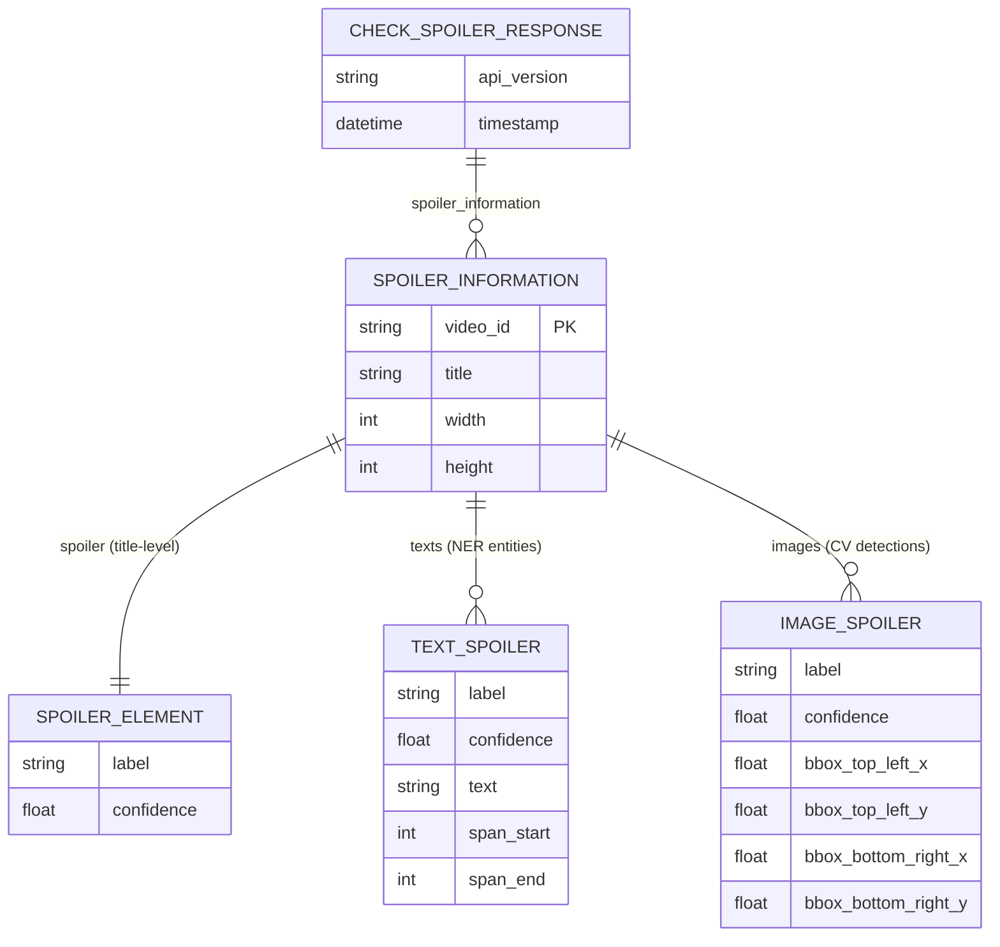
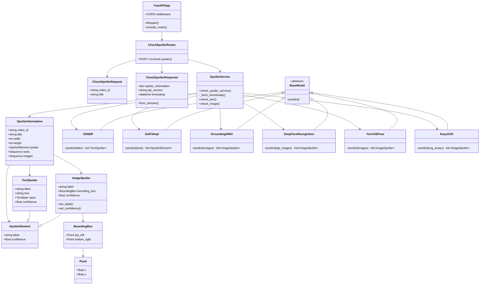

# 📝 Project: Sports Spoiler Detector

> YouTube 스포츠 영상의 제목·썸네일에서 스포일러를 자동 탐지하는 ML API

**Languages:** [English](./README.en.md) · [한국어](./README.md)

---

## 📑 목차

1. [프로젝트 소개](#-프로젝트-소개)
2. [기술 스택](#-기술-스택)
3. [주요 기능](#-주요-기능)
4. [API 명세서](#-api-명세서)
5. [시스템 아키텍처](#-시스템-아키텍처)
6. [Domain Model Diagram](#-domain-model-diagram)
7. [Class Diagram](#-class-diagram)
8. [시작하기 (Local Setup)](#-시작하기-local-setup)
9. [환경 변수 설정](#-환경-변수-설정)
10. [배포 방식](#-배포-방식)
11. [팀 정보](#-팀-정보)
12. [License](#️-license)

---

## 🚀 프로젝트 소개

* **개발 기간**: 2026 Capstone Design
* **핵심 가치**: YouTube에서 스포츠 영상을 시청할 때, 제목과 썸네일에 숨겨진 스포일러를 사전에 탐지하여 시청 경험을 보호한다.
* **서비스 URL**: [https://www.sportspoilerdetector.kro.kr](https://www.sportspoilerdetector.kro.kr)
* **연동 대상**: Chrome Extension (`chrome-extension://*` CORS 허용)

---

## 🛠 기술 스택

### Backend

* **Language**: Python 3.12+
* **Framework**: FastAPI, Uvicorn
* **Validation**: Pydantic v2
* **HTTP Client**: httpx (YouTube 썸네일 비동기 fetch)
* **Package Manager**: uv (`uv.lock`)

### Machine Learning

| 모듈 | 모델 | 용도 |
| --- | --- | --- |
| **NER** | GLiNER2 (DeBERTa-v3-base) | 제목에서 스포츠 엔티티 추출 |
| **Text Classifier** | SetFit + `paraphrase-multilingual-mpnet-base-v2` | Direct / Indirect / Non-Spoiler 3분류 |
| **Object Detector** | Grounding DINO Tiny | 트로피, 공, 골대 등 zero-shot 객체 탐지 |
| **Emotion Recognition** | DeepFace | 썸네일 얼굴 감정 분석 |
| **Pose Detector** | YOLOv26n-pose | 세리머니 포즈 탐지 |
| **OCR** | EasyOCR | 썸네일 오버레이 텍스트 추출 (en/ko) |

* **Deep Learning Runtime**: PyTorch (CUDA → MPS → CPU 자동 선택)

### Infrastructure & DevOps

* **Server**: AWS EC2
* **Container**: Docker, Docker Compose
* **CI/CD**: GitHub Actions
* **Proxy / SSL**: Nginx, Let's Encrypt (Certbot)
* **Registry**: Docker Hub (`seonghun120614/sports-spoiler-detector`)

---

## ✨ 주요 기능

* **배치 스포일러 검사**: YouTube `video_id` + `title` 배열을 한 번의 API 호출로 처리
* **썸네일 자동 수집**: `img.youtube.com/vi/{video_id}/mqdefault.jpg`에서 썸네일 fetch
* **텍스트 분석 파이프라인**
  * 제목 + OCR 추출 텍스트를 SetFit으로 스포일러 등급 분류
  * 제목에 GLiNER NER로 9종 스포츠 엔티티 추출 (승패, 득점, 특수 이벤트 등)
* **이미지 분석 파이프라인** (병렬 배치 처리)
  * Grounding DINO: 트로피, 공, 골대 등 스포일러 객체 탐지
  * DeepFace: 선수/관중 얼굴 감정 (happy, surprise, neutral 등)
  * YOLO Pose: 세리머니 포즈 (양팔 벌림 + 무릎 슬라이딩)
  * EasyOCR: 썸네일 내 오버레이 텍스트 추출 후 텍스트 분류기와 연동
* **Chrome Extension 연동**: CORS를 Chrome Extension origin에 맞게 설정
* **Mock 모드**: `TEST_FLAG` 환경변수 또는 모델 로딩 실패 시 테스트용 mock 응답 반환
* **GPU 가속**: 프로덕션 환경에서 NVIDIA GPU 지원 (Docker Compose)

### NER 엔티티 타입

| 엔티티 | 설명 |
| --- | --- |
| `success` | 승리, 진출 등 긍정적 경기 결과 |
| `failure` | 패배, 탈락 등 부정적 경기 결과 |
| `draw` | 무승부 |
| `round` | 32강, 결승 등 대회 라운드 |
| `name` | 선수·감독 이름 |
| `scoring_text` | 득점, 멀티골, 선방 등 득점 관련 표현 |
| `special_event` | 퇴장, PK, 부상 등 게임 흐름을 바꾸는 이벤트 |
| `emotive` | 충격적, 기적적 등 감정 수식어 |
| `aftermath` | 경기 후 해임, 은퇴 등 여파 |

### 스포일러 분류 레이블

* `Direct Spoiler` — 경기 결과가 직접적으로 드러남
* `Indirect Spoiler` — 결과를 유추할 수 있는 간접적 단서
* `Non-Spoiler` — 스포일러 요소 없음

---

## 📝 API 명세서

| 이름 | type | status | URL | body | 설명 |
| --- | --- | --- | --- | --- | --- |
| 헬스체크 | GET | 200 | `/` | - | API 상태 확인. `{"status": "healthy", "message": "Sports Spoiler Detector API"}` 반환 |
| 스포일러 검사 | POST | 200 | `/v1/check-spoiler` | `CheckSpoilerRequest[]` | YouTube 영상 ID + 제목 배치로 스포일러 탐지 |

#### Request Body — `CheckSpoilerRequest[]`

```json
[
  {
    "video_id": "UXZPxz6H_kU",
    "title": "[3분 하이라이트] 32강 스페인 VS 오스트리아"
  }
]
```

| 필드 | 타입 | 제약 | 설명 |
| --- | --- | --- | --- |
| `video_id` | `string` | 정규식 `^[a-zA-Z0-9_-]{11}$` | YouTube 영상 ID (11자) |
| `title` | `string` | `min_length=1`, extra field 금지 | 영상 제목 |

#### Response — `CheckSpoilerResponse`

```json
{
  "spoiler_information": {
    "UXZPxz6H_kU": {
      "video_id": "UXZPxz6H_kU",
      "title": "[3분 하이라이트] 32강 스페인 VS 오스트리아",
      "width": 320,
      "height": 180,
      "spoiler": {
        "label": "Direct Spoiler",
        "confidence": 0.896
      },
      "texts": [
        {
          "label": "name",
          "confidence": 0.999,
          "text": "32강 스페인",
          "span": { "start": 11, "end": 18 }
        }
      ],
      "images": [
        {
          "label": "happy",
          "confidence": 0.86,
          "bounding_box": {
            "top_left": { "x": 0, "y": 0 },
            "bottom_right": { "x": 319, "y": 179 }
          }
        }
      ]
    }
  },
  "api_version": "v1",
  "timestamp": "2026-07-04T22:00:31.380540"
}
```

| 필드 | 타입 | 설명 |
| --- | --- | --- |
| `spoiler_information` | `dict[string, SpoilerInformation]` | video_id → 분석 결과 매핑 |
| `spoiler` | `SpoilerElement` | 제목 전체 스포일러 분류 결과 |
| `texts` | `TextSpoiler[]` | NER로 추출된 제목 내 엔티티 목록 |
| `images` | `ImageSpoiler[]` | 객체·감정·포즈·OCR 탐지 결과 통합 |
| `api_version` | `string` | API 버전 (기본값 `"v1"`) |
| `timestamp` | `datetime` | 응답 생성 시각 |

#### 특수 동작

* **빈 배열 요청** → `[]` 반환
* **`TEST_FLAG` 환경변수 설정 시** → mock 데이터 반환 (모델 로딩 없이 테스트 가능)

---

## 🏗 시스템 아키텍처

본 프로젝트는 **Nginx를 리버스 프록시** 및 **SSL 종단**으로 활용하고, **FastAPI ML API**를 Docker Compose로 격리 운영하는 아키텍처입니다. **데이터베이스 없이 Stateless**하게 동작합니다.

#### 1. 외부 요청 흐름 (Traffic Flow)

* **HTTPS 단일 진입점**: 사용자(Chrome Extension)는 **443 포트(HTTPS)**로 API에 접속합니다. HTTP(80)는 HTTPS로 리다이렉트됩니다.
* **프록시 라우팅**:
  * 모든 API 요청 → Nginx → **Backend(FastAPI, 8000포트)**
  * Let's Encrypt 인증서 갱신 → Certbot (ACME challenge)

#### 2. 컨테이너 아키텍처

| 컨테이너 | 역할 | 포트 |
| --- | --- | --- |
| **app** | FastAPI + ML 모델 추론 (GPU 지원) | 8000 (내부) |
| **nginx** | SSL 리버스 프록시 | 80, 443 (외부) |
| **certbot** | Let's Encrypt 인증서 자동 갱신 | - |

* **app**: `./static` 볼륨 마운트 (ML 모델 가중치, read-only), healthcheck 내장
* **GPU**: NVIDIA driver + `capabilities: [gpu]` 설정

#### 3. ML 추론 파이프라인

```
Chrome Extension
    │
    ▼ POST /v1/check-spoiler
  Nginx (443)
    │
    ▼
  FastAPI App
    │
    ├─► YouTube CDN ──► 썸네일 fetch (httpx)
    │
    ├─► EasyOCR ──► 썸네일 오버레이 텍스트 추출
    │
    ├─► SetFit ──► 제목 + OCR 텍스트 스포일러 분류
    ├─► GLiNER ──► 제목 NER 엔티티 추출
    │
    ├─► Grounding DINO ──► 객체 탐지 (trophy, ball, goal net)
    ├─► YOLO Pose ──► 세리머니 포즈 탐지
    └─► DeepFace ──► 얼굴 감정 분석
    │
    ▼
  CheckSpoilerResponse JSON
```

#### 4. 배포 파이프라인 (CI/CD)

* `main` 브랜치 push → GitHub Actions 가동
* Docker multi-stage build → Docker Hub push (`:{git_sha}`, `:latest`)
* EC2에 `docker-compose.yml`, `default.conf` SCP 전송
* EC2에서 `docker compose pull app` → `docker compose up -d app` (Rolling Update)

---

## 🧑🏼‍💻 Domain Model Diagram

> 본 프로젝트는 DB를 사용하지 않으며, 아래는 API 응답을 구성하는 **도메인 엔티티** 관계도입니다.

<details>
  <summary><strong>Domain Model Mermaid 펼치기</strong></summary>



</details>

---

## 🐞 Class Diagram

<details>
  <summary><strong>Class Diagram 펼치기</strong></summary>



</details>

---

## 💻 시작하기 (Local Setup)

### 사전 요구사항

* Python 3.12+
* [uv](https://docs.astral.sh/uv/) 패키지 매니저
* ML 모델 가중치 (`static/` 디렉터리 — `.gitignore` 대상, 별도 준비 필요)
  * `static/ner_model/` — GLiNER2 NER
  * `static/soccer_spoiler_mpnet_v1/` — SetFit 텍스트 분류기
  * `static/yolo26n-pose.pt` — YOLO 포즈 모델

### 로컬 실행 (uv)

```bash
# 레포지토리 클론
git clone https://github.com/seonghun120614/Sports-Spoiler-Detector.git
cd Sports-Spoiler-Detector

# 의존성 설치
uv sync

# API 서버 실행
uv run fastapi run src/main.py --host 0.0.0.0 --port 8000
```

### Mock 모드 (모델 없이 테스트)

```bash
TEST_FLAG=1 uv run fastapi run src/main.py --host 0.0.0.0 --port 8000
```

### Docker Compose 실행

```bash
# .env 파일 준비 후
docker compose up --build -d
```

### 테스트 실행

```bash
uv run pytest
```

---

## 🔐 환경 변수 설정

```bash
### .env
APP_ENV=dev
PORT=8000
MODEL_PATH=static
```

| 변수 | 설명 | 비고 |
| --- | --- | --- |
| `APP_ENV` | 앱 실행 환경 | placeholder |
| `PORT` | 서버 포트 | Dockerfile에서 8000 고정 |
| `MODEL_PATH` | 모델 경로 | 코드 내 `static/` 하위 경로 하드코딩 |
| `TEST_FLAG` | Mock 모드 활성화 | 설정 시 ML 모델 로딩 스킵, mock 응답 반환 |

---

## 🚢 배포 방식

* **CI/CD**: GitHub Actions (`.github/workflows/deploy.yml`)
* **트리거**: `main` 브랜치 push
* **Dockerizing**: Multi-stage build (`uv` builder → `python:3.12-slim` runtime)
* **Registry**: Docker Hub
* **배포 대상**: AWS EC2 (Ubuntu)
* **SSL**: Nginx + Let's Encrypt (Certbot)
* **프로덕션 URL**: `https://www.sportspoilerdetector.kro.kr`

#### GitHub Secrets

| Secret | 용도 |
| --- | --- |
| `DOCKERHUB_USERNAME` | Docker Hub 로그인 |
| `DOCKERHUB_TOKEN` | Docker Hub 토큰 |
| `DOCKER_IMAGE_NAME` | 이미지 이름 |
| `EC2_HOST` | EC2 호스트 주소 |
| `EC2_SSH_KEY` | EC2 SSH 키 |

---

## 👥 팀 정보

* **프로젝트**: 2026 Capstone Design
* **Repository**: [seonghun120614/Sports-Spoiler-Detector](https://github.com/seonghun120614/Sports-Spoiler-Detector)

---

## ⚖️ License

**Apache License 2.0**

Copyright 2026. **Sports Spoiler Detector Team** all rights reserved.

본 프로젝트는 Apache License 2.0 하에 배포됩니다. 자세한 내용은 [LICENSE](./LICENSE) 파일을 참고하세요.

* 재배포, 수정, 상업적 사용 가능
* 라이선스 사본 포함 및 변경 사항 고지 필요
* "AS IS" 제공, 보증 없음
