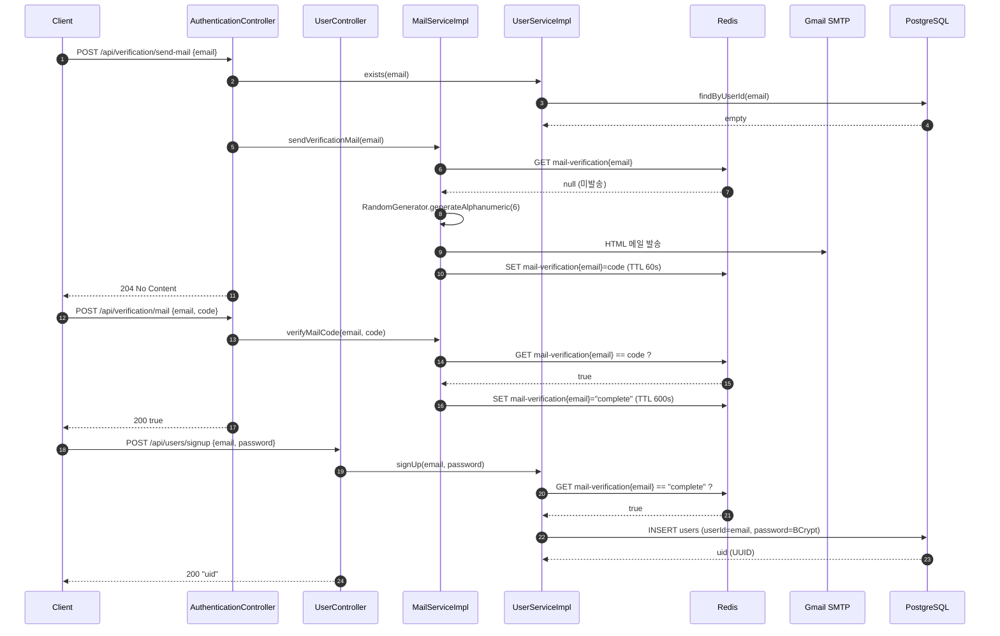
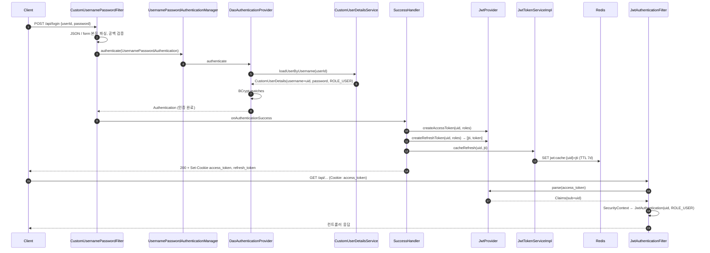
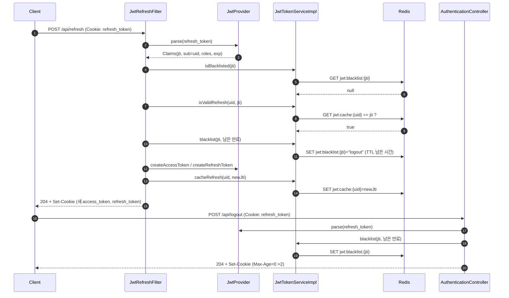
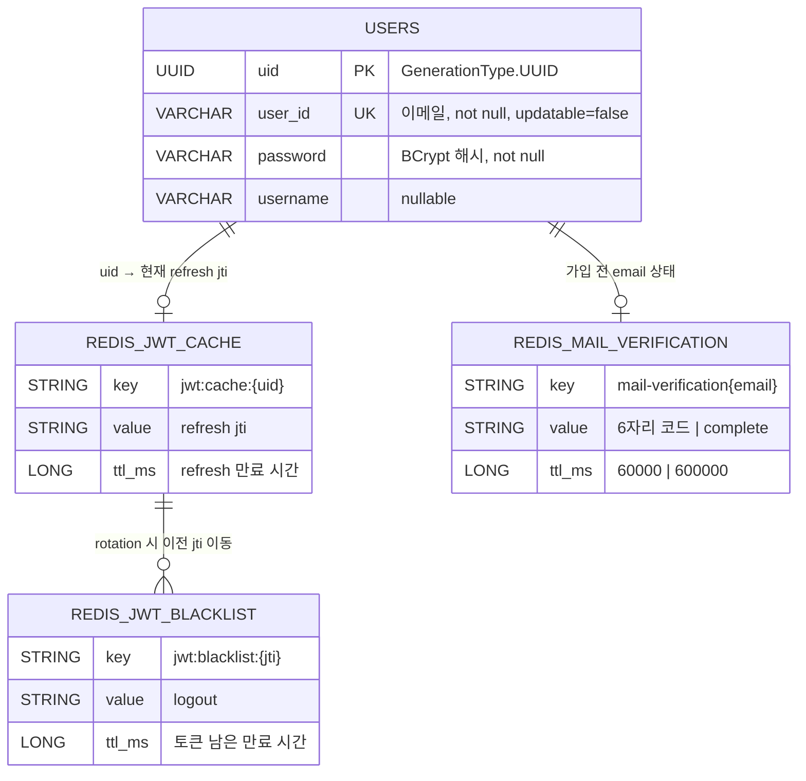

# 📝 Project: Sports Spoiler Detector

[Github Link <- Click](https://github.com/seonghun120614/Sports-Spoiler-Detector)

> YouTube 스포츠 영상의 제목·썸네일에 숨어 있는 스포일러를 미리 탐지하여 시청 경험을 보호한다.

---

## 📑 목차

1. [프로젝트 소개](#-프로젝트-소개)
2. [모노레포 구조](#-모노레포-구조)
3. [기술 스택](#-기술-스택)
4. [주요 기능](#-주요-기능)
5. [API 명세서](#-api-명세서)
6. [시스템 아키텍처](#-시스템-아키텍처)
7. [인증 흐름 (Sequence)](#-인증-흐름-sequence)
8. [E-R Diagram](#-e-r-diagram)
9. [Class Diagram](#-class-diagram)
10. [시작하기 (Local Setup)](#-시작하기-local-setup)
11. [환경 변수 설정](#-환경-변수-설정)
12. [배포 방식](#-배포-방식)
13. [팀 정보](#-팀-정보)
14. [License](#️-license)

---

## 🚀 프로젝트 소개

* **개발 기간**: 2026 Capstone Design
* **핵심 가치**: Chrome Extension이 YouTube 페이지의 영상 제목과 썸네일을 수집하면, ML 서버가 스포일러 여부를 판별하고, Web API 서버가 회원·인증을 담당한다.
* **서비스 URL**: [https://www.sportspoilerdetector.kro.kr](https://www.sportspoilerdetector.kro.kr) (ML API)

```bash
# 빠른 실행 (Web API 개발용 인프라: Redis + PostgreSQL)
cd services/web-api
docker compose -f docker-compose-dev.yml up -d
./gradlew bootRun
```

---

## 🗂 모노레포 구조

```
Sports-Spoiler-Detector/
├── README.md                     # (현재 문서) 전체 흐름 설명
└── services/
    ├── web-api/                  # Java 21 / Spring Boot 4 — 회원가입·이메일 인증·JWT 인증 서버
    │   ├── build.gradle
    │   ├── docker-compose-dev.yml   # 로컬 개발용 Redis + PostgreSQL
    │   ├── Dockerfile               # 비어 있음 (추후 작성 예정)
    │   └── src/main/java/io/github/seonghun/webapi/
    │       ├── config/              # SecurityConfig, RedisCacheConfig, *Property
    │       ├── controller/          # AuthenticationController, UserController
    │       ├── security/
    │       │   ├── jwt/             # JwtAuthenticationFilter, JwtRefreshFilter
    │       │   └── userpwd/         # 로그인(ID/PW) 필터·핸들러·UserDetails
    │       ├── service/             # UserService, MailService, JwtTokenService (+impl)
    │       ├── domain/              # User 엔티티
    │       ├── repository/          # UserRepository (JPA)
    │       └── common/util/         # JwtProvider, CookieHandler, RedisUtil, CustomMailSender, RandomGenerator
    └── llm-worker/               # Python 3.12 / FastAPI — 스포일러 탐지 ML API
        ├── README.md                # ML 파이프라인 상세 문서
        ├── docker-compose.yml       # app(FastAPI, GPU) + nginx + certbot
        └── src/
```

* **web-api**: 본 문서가 중점적으로 다루는 서비스. 이메일 인증 → 회원가입 → 로그인 → JWT 발급/갱신/폐기 흐름을 담당한다.
* **llm-worker**: 제목·썸네일을 분석하는 ML 추론 서버. 상세 내용은 [services/llm-worker/README.md](./services/llm-worker/README.md)를 참고한다.

---

## 🛠 기술 스택

### Web API (services/web-api)

* **Language/Framework**: Java 21 / Spring Boot 4.1.x (Gradle)
* **Web**: Spring Web MVC, Spring Validation
* **Security**: Spring Security (Stateless), JWT (jjwt 0.12.6), BCrypt
* **Persistence**: Spring Data JPA (Hibernate), PostgreSQL
* **Cache / Token Store**: Spring Data Redis (Lettuce), Redis 7
* **Mail**: Spring Boot Starter Mail (Gmail SMTP, STARTTLS)
* **Batch**: Spring Batch (의존성 포함, 미사용)
* **기타**: Lombok

### ML Worker (services/llm-worker)

* **Language/Framework**: Python 3.12 / FastAPI, Uvicorn
* **Models**: GLiNER2 (NER), SetFit (텍스트 분류), Grounding DINO (객체 탐지), DeepFace (감정), YOLOv26n-pose (포즈), EasyOCR (OCR)
* **Runtime**: PyTorch (CUDA → MPS → CPU 자동 선택)

### Infrastructure & DevOps

* **Container**: Docker, Docker Compose
* **Server**: AWS EC2 (llm-worker)
* **CI/CD**: GitHub Actions → Docker Hub → EC2 (llm-worker)
* **Proxy / SSL**: Nginx, Let's Encrypt (Certbot)

---

## ✨ 주요 기능

### Web API

* **이메일 인증 회원가입**: 인증 코드 발송 → 코드 검증 → 회원가입의 3단계. 각 단계 상태는 Redis에 TTL과 함께 저장된다.
* **ID/PW 로그인**: JSON 또는 `application/x-www-form-urlencoded` 본문을 모두 지원하는 커스텀 로그인 필터.
* **JWT 쿠키 인증**: Access Token과 Refresh Token을 `HttpOnly` + `Secure` + `SameSite=Strict` 쿠키로 전달. 서버는 세션을 만들지 않는다 (STATELESS).
* **Refresh Token Rotation**: 갱신 시 이전 Refresh Token의 `jti`를 블랙리스트에 올리고, 사용자별 최신 `jti` 하나만 Redis에 유지한다.
* **로그아웃**: Refresh Token을 남은 만료 시간만큼 블랙리스트에 등록하고 쿠키를 삭제한다.
* **Redis 캐시 설정**: `@EnableCaching` + JSON 직렬화, 기본 TTL 5분의 `CacheManager` 등록.

### ML Worker

* **배치 스포일러 검사**: `video_id` + `title` 배열을 한 번의 요청으로 처리.
* **텍스트/이미지 병렬 파이프라인**: 제목 분류·NER + 썸네일 객체·감정·포즈·OCR 분석.
* **Chrome Extension 연동**: `chrome-extension://*` origin CORS 허용.

---

## 📝 API 명세서

### Web API (Spring Boot, `/api`)

| 이름 | type | status | URL | body | 설명 |
| --- | --- | --- | --- | --- | --- |
| 이메일 인증코드 발송 | POST | 204, 400, 500 | /api/verification/send-mail | { "email": string } | 미가입 이메일에 6자리 영숫자 코드 발송. Redis에 60초 TTL로 저장. 이미 발송된 코드가 살아 있으면 예외. |
| 이메일 인증코드 확인 | POST | 200, 400 | /api/verification/mail | { "email": string, "code": string } | 코드 일치 여부를 `true/false`로 반환. 일치 시 해당 이메일을 `complete` 상태로 10분간 유지. |
| 회원가입 | POST | 200, 400 | /api/users/signup | { "email": string, "password": string } | `complete` 상태인 이메일만 가입 가능. 비밀번호 8자 이상, BCrypt로 저장. 생성된 사용자 `uid`(UUID) 반환. |
| 로그인 | POST | 200, 401 | /api/login | { "userId": string, "password": string } | JSON 또는 form 본문. 성공 시 `access_token`, `refresh_token` 쿠키 설정. 실패 시 `{ "status": 401, "message": "인증에 실패하였습니다." }`. |
| 토큰 갱신 | POST | 204, 401 | /api/refresh | - | 쿠키의 `refresh_token` 검증 후 Access/Refresh 재발급 (Rotation). 블랙리스트 또는 사용된 토큰이면 401. |
| 로그아웃 | POST | 204 | /api/logout | - | 쿠키의 `refresh_token` 블랙리스트 등록 후 두 쿠키 모두 `Max-Age=0`으로 삭제. |

* 위 6개 엔드포인트만 `permitAll`이며, 그 외 모든 요청은 `access_token` 쿠키 인증이 필요하다.
* 인증 실패 시 응답
  * Access Token 만료: 인증 없이 통과 → 인가 단계에서 거절
  * Access Token 서명 오류 등 형식 불량: `401` + `"잘못된 형식"`

### ML API (FastAPI, `/v1`)

| 이름 | type | status | URL | body | 설명 |
| --- | --- | --- | --- | --- | --- |
| 헬스체크 | GET | 200 | / | - | `{"status": "healthy", "message": "Sports Spoiler Detector API"}` |
| 스포일러 검사 | POST | 200 | /v1/check-spoiler | `[{ "video_id": string, "title": string }]` | YouTube 영상 ID(11자) + 제목 배치로 스포일러 탐지 |

요청·응답 스키마 상세는 [services/llm-worker/README.md](./services/llm-worker/README.md#-api-명세서)를 참고한다.

---

## 🏗 시스템 아키텍처

본 프로젝트는 **회원·인증을 담당하는 Spring Boot Web API**와 **ML 추론을 담당하는 FastAPI Worker**가 각각 독립된 서비스로 구성된 모노레포 구조입니다. Web API는 **Redis를 토큰 저장소 겸 인증 상태 저장소**로, **PostgreSQL을 회원 저장소**로 사용합니다.

```
Chrome Extension
    │
    ├──(회원가입 / 로그인 / 토큰 갱신)──► Web API (Spring Boot, 8080)
    │                                        ├──► PostgreSQL (users)
    │                                        ├──► Redis (jwt:cache, jwt:blacklist, mail-verification)
    │                                        └──► Gmail SMTP (인증 코드 메일)
    │
    └──(스포일러 검사)──► Nginx (443) ──► ML Worker (FastAPI, 8000)
                                              └──► YouTube CDN (썸네일 fetch)
```

#### 1. Web API 요청 처리 흐름 (Security Filter Chain)

`SecurityConfig`는 세 개의 커스텀 필터를 다음 순서로 등록합니다.

| 순서 | 필터 | 적용 경로 | 역할 |
| --- | --- | --- | --- |
| 1 | `JwtRefreshFilter` | `POST /api/refresh`만 | `refresh_token` 쿠키 검증 → 블랙리스트/캐시 확인 → 새 토큰 발급 후 **체인을 종료**하고 204 응답 |
| 2 | `JwtAuthenticationFilter` | 모든 요청 | `access_token` 쿠키 파싱 → `JwtAuthentication`을 `SecurityContext`에 저장 |
| 3 | `CustomUsernamePasswordFilter` | `POST /api/login`만 | JSON/form 본문 파싱 → `DaoAuthenticationProvider` 인증 → 성공/실패 핸들러 |

* **CORS / CSRF / formLogin / httpBasic**: 모두 비활성화. 브라우저 세션 대신 쿠키 기반 JWT를 사용한다.
* **Session**: `SessionCreationPolicy.STATELESS`. 서버는 `HttpSession`을 생성하지 않는다.
* **권한**: 현재 모든 인증 사용자에게 고정으로 `ROLE_USER`가 부여된다.

#### 2. 토큰 설계

| 토큰 | 저장 위치 | 만료 (local 설정) | 클레임 |
| --- | --- | --- | --- |
| Access Token | `access_token` 쿠키 | 30분 (`1800000` ms) | `sub`=사용자 uid, `roles` |
| Refresh Token | `refresh_token` 쿠키 | 7일 (`604800000` ms) | `jti`=UUID, `sub`=사용자 uid, `roles` |

* 서명: `jwt.secret`을 HMAC-SHA 키로 사용 (`Keys.hmacShaKeyFor`).
* 쿠키 속성은 `cookie.*` 프로퍼티(`CookieProperty`)로 제어한다. HTTPS 미적용 환경에서는 `secure: false`, `same-site: Lax`로 낮춰야 브라우저가 쿠키를 저장한다.

#### 3. Redis 키 설계

| Key | Value | TTL | 쓰는 곳 |
| --- | --- | --- | --- |
| `jwt:cache:{uid}` | 현재 유효한 Refresh Token의 `jti` | Refresh 만료 시간 | 로그인 성공, 토큰 갱신 |
| `jwt:blacklist:{jti}` | `"logout"` | 해당 토큰의 남은 만료 시간 | 로그아웃, 토큰 갱신(이전 토큰 폐기) |
| `mail-verification{email}` | 6자리 인증 코드 | 60초 | 인증코드 발송 |
| `mail-verification{email}` | `"complete"` | 10분 | 인증코드 확인 성공 → 회원가입에서 검사 후 소비 |

* Refresh Token은 **사용자당 하나만 유효**하다. 새로 발급될 때마다 `jwt:cache:{uid}`가 덮어써지고, 이전 `jti`는 블랙리스트로 이동한다.
* `RedisUtil`이 `StringRedisTemplate`을 감싸 `save / get / isValidAndEquals / delete`를 제공한다.

#### 4. 로컬 개발 컨테이너 (docker-compose-dev.yml)

| 컨테이너 | 이미지 | 포트 | 볼륨 | 비고 |
| --- | --- | --- | --- | --- |
| `spring-redis-redis` | redis:7 | 6379 | `redis-data:/data` | `redis-cli ping` healthcheck (10s 간격, 5회) |
| `spring-postgres` | postgres:latest | 5432 | `postgres_data:/var/lib/postgresql` | DB `testdb`, 계정 `postgres / 1234` |

* Spring 애플리케이션 자체는 컨테이너에 포함되지 않으며 호스트에서 `./gradlew bootRun`으로 실행한다.
* `application.yaml`은 `localhost:6379`, `localhost:5432/testdb`를 바라보도록 고정되어 있어 위 compose와 바로 연결된다.
* `spring.jpa.hibernate.ddl-auto: update`로 기동 시 `users` 테이블이 자동 생성된다.

#### 5. ML Worker 컨테이너 (services/llm-worker/docker-compose.yml)

| 컨테이너 | 역할 | 포트 |
| --- | --- | --- |
| `app` | FastAPI + ML 모델 추론 (NVIDIA GPU) | 8000 (내부) |
| `nginx` | SSL 종단 리버스 프록시, HTTP→HTTPS 리다이렉트 | 80, 443 (외부) |
| `certbot` | Let's Encrypt 인증서 발급/갱신 | - |

---

## 🔁 인증 흐름 (Sequence)

<details>
  <summary><strong>1) 이메일 인증 → 회원가입</strong></summary>



</details>

<details>
  <summary><strong>2) 로그인 → 인증 요청</strong></summary>



</details>

<details>
  <summary><strong>3) 토큰 갱신 (Rotation) → 로그아웃</strong></summary>



</details>

---

## 🧑🏼‍💻 E-R Diagram

> Web API는 현재 `users` 단일 테이블을 사용하며, 인증 상태는 RDB가 아닌 Redis 키로 관리합니다. Redis 키는 참고용으로 함께 표기했습니다.

<details>
  <summary><strong>ERD Mermaid 펼쳐보기</strong></summary>



</details>

---

## 🐞 Class Diagram

```mermaid
classDiagram
    direction TB

    %% ========== Config ==========
    class SecurityConfig {
        +securityFilterChain(HttpSecurity) SecurityFilterChain
        +usernamePasswordFilter() CustomUsernamePasswordFilter
        +daoAuthenticationProvider() DaoAuthenticationProvider
        +passwordEncoder() PasswordEncoder
    }
    class RedisCacheConfig {
        +cacheManager(RedisConnectionFactory) CacheManager
        +stringRedisTemplate(RedisConnectionFactory) StringRedisTemplate
    }
    class JwtProperty {
        +String secret
        +long accessExpireMilliSeconds
        +long refreshExpireMilliSeconds
    }
    class CookieProperty {
        +boolean httpOnly
        +boolean secure
        +String sameSite
        +String path
    }

    %% ========== Controller ==========
    class AuthenticationController {
        +sendVerificationMail(SendMailRequest) 204
        +verifyMail(VerifyMailRequest) Boolean
        +logout(refreshToken, response) 204
    }
    class UserController {
        +signup(SignupRequest) String uid
    }

    %% ========== Service ==========
    class UserService {
        <<interface>>
        +exists(email) boolean
        +signUp(email, password) String
        +withdraw(email, code)
    }
    class MailService {
        <<interface>>
        +sendVerificationMail(email)
        +verifyMailCode(email, code) boolean
    }
    class JwtTokenService {
        <<interface>>
        +isBlacklisted(jti) boolean
        +isValidRefresh(uid, jti) boolean
        +blacklist(jti, remainingMillis)
        +cacheRefresh(uid, jti)
    }
    class UserServiceImpl
    class MailServiceImpl
    class JwtTokenServiceImpl

    %% ========== Security: 로그인 ==========
    class CustomUsernamePasswordFilter {
        +attemptAuthentication(request, response) Authentication
        -jsonParsing(request) LoginRequest
        -formParsing(request) LoginRequest
    }
    class UsernamePasswordAuthenticationManager {
        +authenticate(Authentication) Authentication
    }
    class UsernamePasswordAuthenticationSuccessHandler {
        +onAuthenticationSuccess()
    }
    class UsernamePasswordAuthenticationFailureHandler {
        +onAuthenticationFailure()
    }
    class CustomUserDetailsService {
        +loadUserByUsername(userId) UserDetails
    }
    class CustomUserDetails {
        +String username
        +String password
        +Collection authorities
    }

    %% ========== Security: JWT ==========
    class JwtAuthenticationFilter {
        +doFilterInternal()
    }
    class JwtRefreshFilter {
        +doFilterInternal()
        +shouldNotFilter(request) boolean
    }
    class JwtAuthentication {
        +Object principal
        +Collection authorities
        +boolean authenticated
    }

    %% ========== Util ==========
    class JwtProvider {
        +createAccessToken(username, roles) String
        +createRefreshToken(username, roles) String[]
        +parse(token) Claims
    }
    class CookieHandler {
        +createCookie(name, value, maxAge) ResponseCookie
        +getMap(Cookie[]) Map
    }
    class RedisUtil {
        +save(prefix, key, value, ttlMillis)
        +get(prefix, key) String
        +isValidAndEquals(prefix, key, value) boolean
        +delete(prefix, key)
    }
    class CustomMailSender {
        +sendEmail(to, subject, htmlContent)
    }
    class RandomGenerator {
        +generateAlphanumeric(length) String
    }

    %% ========== Domain ==========
    class User {
        +UUID uid
        +String userId
        +String password
        +String username
    }
    class UserRepository {
        <<interface>>
        +findByUserId(userId) Optional~User~
    }

    %% ========== Relationships ==========
    SecurityConfig --> CustomUsernamePasswordFilter : builds
    SecurityConfig --> JwtAuthenticationFilter : registers
    SecurityConfig --> JwtRefreshFilter : registers
    SecurityConfig --> JwtProperty : enables
    SecurityConfig --> CookieProperty : enables

    CustomUsernamePasswordFilter --> UsernamePasswordAuthenticationManager
    CustomUsernamePasswordFilter --> UsernamePasswordAuthenticationSuccessHandler
    CustomUsernamePasswordFilter --> UsernamePasswordAuthenticationFailureHandler
    UsernamePasswordAuthenticationManager --> CustomUserDetailsService : via DaoAuthenticationProvider
    CustomUserDetailsService --> UserRepository
    CustomUserDetailsService --> CustomUserDetails : creates
    UsernamePasswordAuthenticationSuccessHandler --> JwtProvider
    UsernamePasswordAuthenticationSuccessHandler --> JwtTokenService
    UsernamePasswordAuthenticationSuccessHandler --> CookieHandler

    JwtAuthenticationFilter --> JwtProvider
    JwtAuthenticationFilter --> CookieHandler
    JwtAuthenticationFilter --> JwtAuthentication : sets in SecurityContext
    JwtRefreshFilter --> JwtProvider
    JwtRefreshFilter --> JwtTokenService
    JwtRefreshFilter --> CookieHandler

    AuthenticationController --> UserService
    AuthenticationController --> MailService
    AuthenticationController --> JwtTokenService
    AuthenticationController --> JwtProvider
    AuthenticationController --> CookieHandler
    UserController --> UserService

    UserService <|.. UserServiceImpl
    MailService <|.. MailServiceImpl
    JwtTokenService <|.. JwtTokenServiceImpl
    UserServiceImpl --> UserRepository
    UserServiceImpl --> RedisUtil
    MailServiceImpl --> RedisUtil
    MailServiceImpl --> CustomMailSender
    MailServiceImpl --> RandomGenerator
    JwtTokenServiceImpl --> RedisUtil
    JwtTokenServiceImpl --> JwtProperty

    JwtProvider --> JwtProperty
    CookieHandler --> CookieProperty
    UserRepository --> User
```

<details>
  <summary><strong>Class Diagram 펼쳐보기</strong></summary>



</details>

---

## 💻 시작하기 (Local Setup)

### 사전 요구사항

* Java 21 (Gradle Wrapper 포함, 별도 Gradle 설치 불필요)
* Docker / Docker Compose
* Gmail 앱 비밀번호 (이메일 인증 코드 발송용)

### Web API 실행

```bash
# 레포지토리 클론
git clone https://github.com/seonghun120614/Sports-Spoiler-Detector.git
cd Sports-Spoiler-Detector/services/web-api

# 1) Redis + PostgreSQL 컨테이너 기동
docker compose -f docker-compose-dev.yml up -d

# 2) application-local.yml 에 JWT / Cookie / Mail 설정 작성 (아래 환경 변수 설정 참고)

# 3) Spring Boot 실행 (기본 프로필: local)
./gradlew bootRun

# 4) 테스트
./gradlew test

# 종료 (볼륨 포함 삭제)
docker compose -f docker-compose-dev.yml down -v
```

### 동작 확인 예시

```bash
# 인증 코드 발송
curl -X POST http://localhost:8080/api/verification/send-mail \
  -H "Content-Type: application/json" \
  -d '{"email":"you@example.com"}'

# 인증 코드 확인
curl -X POST http://localhost:8080/api/verification/mail \
  -H "Content-Type: application/json" \
  -d '{"email":"you@example.com","code":"Ab12Cd"}'

# 회원가입
curl -X POST http://localhost:8080/api/users/signup \
  -H "Content-Type: application/json" \
  -d '{"email":"you@example.com","password":"password123"}'

# 로그인 (쿠키 저장)
curl -c cookie.txt -X POST http://localhost:8080/api/login \
  -H "Content-Type: application/json" \
  -d '{"userId":"you@example.com","password":"password123"}'

# 토큰 갱신 / 로그아웃
curl -b cookie.txt -c cookie.txt -X POST http://localhost:8080/api/refresh
curl -b cookie.txt -X POST http://localhost:8080/api/logout
```

> 로컬 HTTP 환경에서 브라우저로 테스트할 때는 `cookie.secure`를 `false`로 낮춰야 쿠키가 저장됩니다. `curl`은 `Secure` 속성을 무시하므로 위 예시는 그대로 동작합니다.

### ML Worker 실행

```bash
cd services/llm-worker
uv sync
uv run fastapi run src/main.py --host 0.0.0.0 --port 8000

# 모델 없이 mock 응답으로 테스트
TEST_FLAG=1 uv run fastapi run src/main.py --host 0.0.0.0 --port 8000
```

---

## 🔐 환경 변수 설정

### Web API

프로필은 `SPRING_PROFILES` 환경 변수로 선택하며, 기본값은 `local`입니다. 공통 설정은 `application.yaml`, 민감 설정은 `application-local.yml`에 둡니다.

#### application.yaml (공통, 저장소 포함)

```yaml
spring:
  application:
    name: web-api
  profiles:
    active: ${SPRING_PROFILES:local}
  data:
    redis:
      host: localhost
      port: 6379
      password: 1234
  datasource:
    url: jdbc:postgresql://localhost:5432/testdb
    username: postgres
    password: 1234
    driver-class-name: org.postgresql.Driver
  jpa:
    show-sql: true
    hibernate:
      ddl-auto: update
    properties:
      hibernate:
        format_sql: true
        use_sql_comments: true
        dialect: org.hibernate.dialect.PostgreSQLDialect
```

> **주의**: `docker-compose-dev.yml`의 Redis 컨테이너는 비밀번호 없이 기동됩니다. `spring.data.redis.password`를 설정한 상태로 접속하면 Redis 7이 `AUTH` 명령을 거부할 수 있으므로, 둘 중 하나를 맞춰 주세요 (compose에 `--requirepass 1234` 추가 또는 yaml의 `password` 제거).

#### application-local.yml Template (민감 정보, 직접 작성)

```yaml
jwt:
  secret: "<32바이트 이상의 HMAC 비밀키>"
  access-expire-milli-seconds: 1800000      # 30분
  refresh-expire-milli-seconds: 604800000   # 7일

cookie:
  secure: true          # HTTP 로컬 테스트 시 false
  http-only: true
  same-site: "Strict"   # 크로스 사이트 필요 시 None (secure=true 필수)
  path: "/"

logging:
  level:
    org.springframework.security: DEBUG

spring:
  mail:
    host: smtp.gmail.com
    port: 587
    username: <gmail 주소>
    password: <gmail 앱 비밀번호>
    properties:
      mail:
        smtp:
          auth: true
          starttls:
            enable: true
            required: true
          connectiontimeout: 5000
          timeout: 5000
          writetimeout: 5000
```

| 키 | 설명 |
| --- | --- |
| `jwt.secret` | Access/Refresh 토큰 서명 키. `JwtProvider`가 `Keys.hmacShaKeyFor`로 로드 |
| `jwt.access-expire-milli-seconds` | Access Token 만료 (ms) |
| `jwt.refresh-expire-milli-seconds` | Refresh Token 만료 (ms). Redis `jwt:cache` TTL에도 사용 |
| `cookie.*` | `CookieHandler`가 모든 토큰 쿠키에 적용하는 속성 |
| `spring.mail.*` | `CustomMailSender`가 사용하는 SMTP 설정. 인증 코드 메일은 HTML 포맷 |

### ML Worker

```bash
# services/llm-worker/.env
APP_ENV=dev
PORT=8000
MODEL_PATH=static
# TEST_FLAG=1   # 설정 시 모델 로딩 없이 mock 응답
```

---

## 🚢 배포 방식

### ML Worker (구축 완료)

* **CI/CD**: GitHub Actions (`services/llm-worker/.github/workflows/deploy.yml`), `main` 브랜치 push 트리거
* **Dockerizing**: Multi-stage build (`uv` builder → `python:3.12-slim` runtime), Docker Hub push (`:{git_sha}`, `:latest`)
* **배포**: EC2에 `docker-compose.yml`, `default.conf` 전송 후 `docker compose pull app && docker compose up -d app`
* **SSL**: Nginx + Let's Encrypt (Certbot), `https://www.sportspoilerdetector.kro.kr`

### Web API (진행 중)

* `services/web-api/Dockerfile`은 현재 비어 있으며, 컨테이너 이미지 빌드와 CI/CD는 추후 작성 예정입니다.
* 현재는 `docker-compose-dev.yml`로 Redis/PostgreSQL만 컨테이너로 띄우고 애플리케이션은 호스트에서 실행합니다.
* 운영 배포 시 체크리스트
  * `jwt.secret`, SMTP 자격 증명을 환경 변수 또는 시크릿으로 주입
  * HTTPS 적용 후 `cookie.secure=true`, 크로스 사이트가 필요하면 `same-site=None`
  * Redis 비밀번호를 compose와 yaml 양쪽에 일치시킬 것
  * `ddl-auto`를 `update`에서 `validate` 등으로 전환

---

## 👥 팀 정보

* **프로젝트**: 2026 Capstone Design
* **Repository**: [seonghun120614/Sports-Spoiler-Detector](https://github.com/seonghun120614/Sports-Spoiler-Detector)

---

## ⚖️ License

**Apache License 2.0**

Copyright 2026. **Sports Spoiler Detector Team** all rights reserved.

본 프로젝트는 Apache License 2.0 하에 배포됩니다. 자세한 내용은 [services/llm-worker/LICENSE](./services/llm-worker/LICENSE) 파일을 참고하세요.

* 재배포, 수정, 상업적 사용 가능
* 라이선스 사본 포함 및 변경 사항 고지 필요
* "AS IS" 제공, 보증 없음
