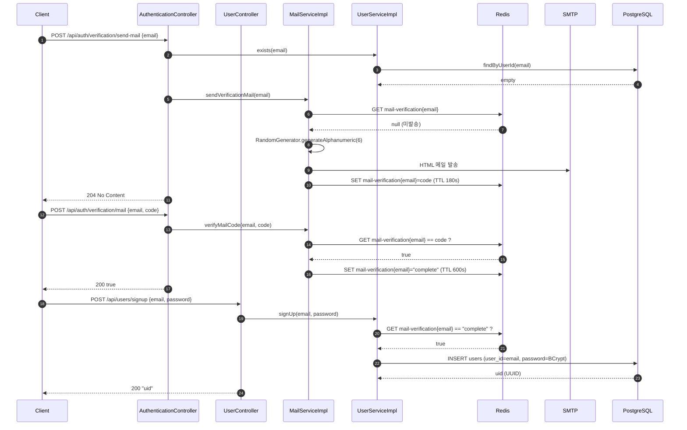
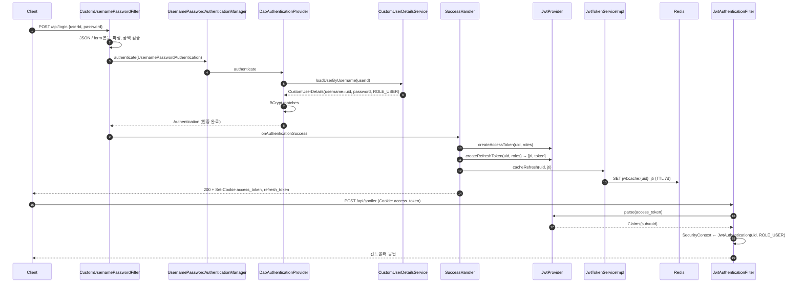
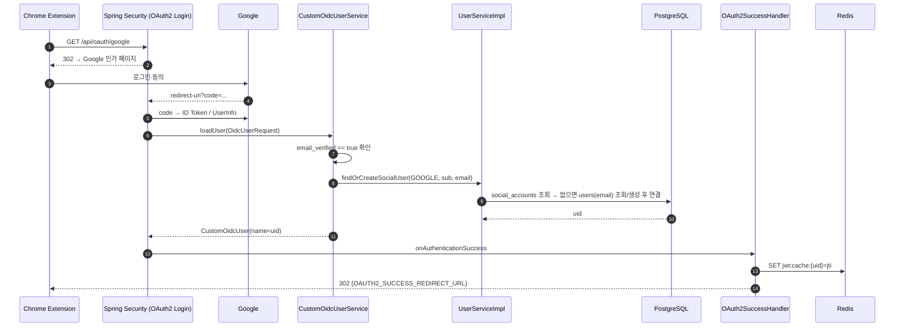
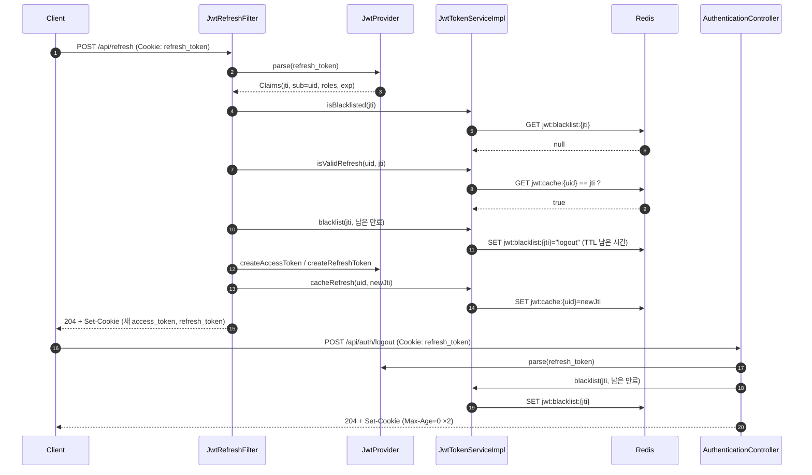
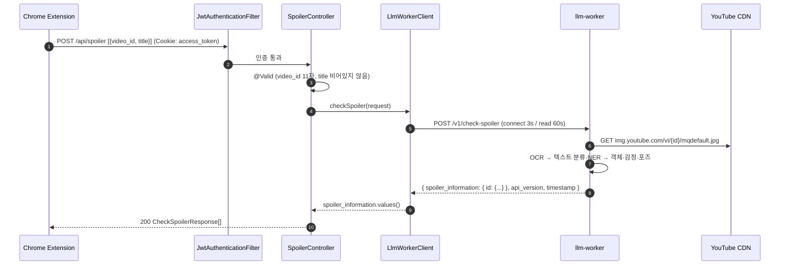
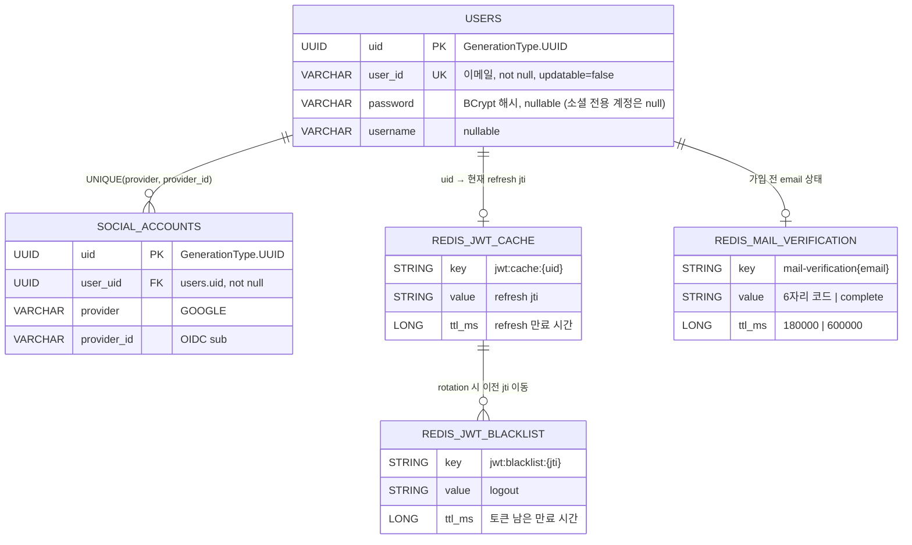

# 📝 Project: Sports Spoiler Detector

[Github Link <- Click](https://github.com/seonghun120614/Sports-Spoiler-Detector)

> YouTube 스포츠 영상의 제목·썸네일에 숨어 있는 스포일러를 미리 탐지하여 시청 경험을 보호한다.

---

## 📑 목차

1. [프로젝트 소개](#-프로젝트-소개)
2. [모노레포 구조](#-모노레포-구조)
3. [기술 스택](#-기술-스택)
4. [주요 기능](#-주요-기능)
5. [API 명세서](#-api-명세서)
6. [시스템 아키텍처](#-시스템-아키텍처)
7. [인증 흐름 (Sequence)](#-인증-흐름-sequence)
8. [E-R Diagram](#-e-r-diagram)
9. [Class Diagram](#-class-diagram)
10. [시작하기 (Local Setup)](#-시작하기-local-setup)
11. [환경 변수 설정](#-환경-변수-설정)
12. [배포 방식](#-배포-방식)
13. [팀 정보](#-팀-정보)
14. [License](#️-license)

---

## 🚀 프로젝트 소개

* **개발 기간**: 2026 Capstone Design
* **핵심 가치**: Chrome Extension이 YouTube 페이지의 영상 ID·제목을 수집해 **Web API**로 보내면, Web API가 사용자를 인증한 뒤 내부의 **ML Worker**에 스포일러 판별을 위임하고 결과를 돌려준다.
* **서비스 URL**: [https://www.sportspoilerdetector.kro.kr](https://www.sportspoilerdetector.kro.kr) (Nginx → Web API)

```bash
# 빠른 실행 (Web API 개발용 인프라: Redis + PostgreSQL)
cd services/web-api
docker compose up -d
./gradlew bootRun
```

---

## 🗂 모노레포 구조

```
Sports-Spoiler-Detector/
├── README.md                     # (현재 문서) 전체 흐름 설명
├── docker-compose.yml            # 운영 배포용: llm-worker, back(web-api), redis, postgres, nginx, certbot
├── default.conf                  # Nginx 설정 (HTTP→HTTPS, 443 → back:8080)
├── .github/workflows/deploy.yml  # 두 서비스 이미지 빌드·푸시 + EC2 배포
└── services/
    ├── web-api/                  # Java 21 / Spring Boot 4 — 인증 + 스포일러 검사 게이트웨이
    │   ├── build.gradle
    │   ├── Dockerfile               # Gradle 빌드 → layered jar → eclipse-temurin:21-jre
    │   ├── docker-compose.yml       # 로컬 개발용 Redis + PostgreSQL
    │   └── src/main/
    │       ├── java/io/github/seonghun/webapi/
    │       │   ├── client/              # LlmWorkerClient (RestClient), dto/CheckSpoiler*
    │       │   ├── config/              # SecurityConfig, RedisCacheConfig, properties/*Property
    │       │   ├── controller/          # AuthenticationController, UserController, SpoilerController
    │       │   ├── security/
    │       │   │   ├── jwt/             # JwtAuthenticationFilter, JwtRefreshFilter
    │       │   │   ├── oauth/           # Google OIDC: CustomOidcUserService, OAuth2SuccessHandler
    │       │   │   └── userpwd/         # 로그인(ID/PW) 필터·핸들러·UserDetails
    │       │   ├── service/             # UserService, MailService, JwtTokenService (+impl)
    │       │   ├── domain/              # User, SocialAccount, Provider
    │       │   ├── repository/          # UserRepository, SocialAccountRepository (JPA)
    │       │   └── common/util/         # JwtProvider, CookieHandler, RedisUtil, CustomMailSender, RandomGenerator
    │       └── resources/
    │           ├── application.yaml         # 공통 설정 (프로필, Liquibase, llm-worker)
    │           ├── application-local.yml    # 로컬 프로필
    │           ├── application-deploy.yml   # 운영 프로필 (모든 값 환경 변수 주입)
    │           └── db/changelog/            # Liquibase 마이그레이션
    └── llm-worker/               # Python 3.12 / FastAPI — 스포일러 탐지 ML API
        ├── README.md / README.en.md # ML 파이프라인 상세 문서
        ├── Dockerfile               # uv builder → python:3.12-slim-trixie runtime
        ├── static/                  # 모델 가중치 (NER, SetFit, YOLO pose) — 운영에서는 볼륨 마운트
        ├── src/
        └── tests/
```

* **web-api**: 외부에 노출되는 유일한 애플리케이션. 이메일 인증 회원가입, ID/PW 로그인, Google OAuth2(OIDC) 로그인, JWT 발급/갱신/폐기, 그리고 스포일러 검사 요청을 llm-worker로 중계한다.
* **llm-worker**: 제목·썸네일을 분석하는 ML 추론 서버. 운영에서는 Docker 네트워크 내부에서만 web-api가 호출한다. 상세 내용은 [services/llm-worker/README.md](./services/llm-worker/README.md)를 참고한다.

---

## 🛠 기술 스택

### Web API (services/web-api)

* **Language/Framework**: Java 21 / Spring Boot 4.1.x (Gradle)
* **Web**: Spring Web MVC, Spring Validation, RestClient (llm-worker 호출)
* **Security**: Spring Security (Stateless), OAuth2 Client (Google OIDC), JWT (jjwt 0.12.6), BCrypt
* **Persistence**: Spring Data JPA (Hibernate), PostgreSQL, Liquibase (스키마 마이그레이션)
* **Cache / Token Store**: Spring Data Redis (Lettuce), Redis 7
* **Mail**: Spring Boot Starter Mail (SMTP, STARTTLS)
* **Monitoring**: Spring Boot Actuator (`/actuator/health`)
* **Batch**: Spring Batch (의존성 포함, 미사용)
* **기타**: Lombok

### ML Worker (services/llm-worker)

* **Language/Framework**: Python 3.12 / FastAPI, Uvicorn, uv
* **Models**: GLiNER2 (NER), SetFit (텍스트 분류), Grounding DINO (객체 탐지), DeepFace (감정), YOLOv26n-pose (포즈), EasyOCR (OCR)
* **Runtime**: PyTorch (CUDA → MPS → CPU 자동 선택)

### Infrastructure & DevOps

* **Container**: Docker, Docker Compose (루트 `docker-compose.yml` 하나로 전체 스택 구성)
* **Server**: AWS EC2 (NVIDIA GPU)
* **CI/CD**: GitHub Actions (matrix 빌드) → Docker Hub → EC2
* **Proxy / SSL**: Nginx 1.27, Let's Encrypt (Certbot)

---

## ✨ 주요 기능

### Web API

* **이메일 인증 회원가입**: 인증 코드 발송 → 코드 검증 → 회원가입의 3단계. 각 단계 상태는 Redis에 TTL과 함께 저장된다.
* **ID/PW 로그인**: JSON 또는 `application/x-www-form-urlencoded` 본문을 모두 지원하는 커스텀 로그인 필터.
* **Google OAuth2 (OIDC) 로그인**: `email_verified`가 true인 계정만 허용. `social_accounts`로 연결 정보를 관리하며, 같은 이메일의 기존 회원이 있으면 그 계정에 연결한다. 성공 시 쿠키를 설정하고 Chrome Extension 콜백 URL(`OAUTH2_SUCCESS_REDIRECT_URL`, 예: `https://<extension-id>.chromiumapp.org/callback`)로 토큰을 fragment에 담아 리다이렉트한다.
* **JWT 쿠키 인증**: Access Token과 Refresh Token을 `HttpOnly` 쿠키로 전달 (`Secure`/`SameSite`는 프로필별 설정). 서버는 세션을 만들지 않는다 (STATELESS).
* **Refresh Token Rotation**: 갱신 시 이전 Refresh Token의 `jti`를 블랙리스트에 올리고, 사용자별 최신 `jti` 하나만 Redis에 유지한다.
* **로그아웃**: Refresh Token을 남은 만료 시간만큼 블랙리스트에 등록하고 쿠키를 삭제한다.
* **스포일러 검사 게이트웨이**: 인증된 사용자의 요청을 검증(`video_id` 11자, `title` 비어있지 않음)한 뒤 llm-worker `/v1/check-spoiler`로 전달하고, 응답의 `spoiler_information` 맵을 배열로 펼쳐 반환한다.
* **CORS**: `/api/**`에 대해 `CORS_ALLOWED_ORIGINS` 하나의 origin만 허용, `allowCredentials=true`.
* **Redis 캐시 설정**: `@EnableCaching` + JSON 직렬화, 기본 TTL 5분의 `CacheManager` 등록.

### ML Worker

* **배치 스포일러 검사**: `video_id` + `title` 배열을 한 번의 요청으로 처리.
* **텍스트/이미지 파이프라인**: YouTube 썸네일(`mqdefault.jpg`)을 받아 OCR → 제목·OCR 텍스트 분류·NER → 썸네일 객체·감정·포즈 분석.
* **Mock 모드**: `TEST_FLAG` 환경 변수가 있거나 모델 로딩에 실패하면 모델 없이 고정 샘플 응답을 반환한다.

---

## 📝 API 명세서

### Web API (Spring Boot, 8080)

| 이름 | type | status | URL | body | 설명 |
| --- | --- | --- | --- | --- | --- |
| 이메일 인증코드 발송 | POST | 204, 400, 500 | /api/auth/verification/send-mail | { "email": string } | 미가입 이메일에 6자리 영숫자 코드 발송. Redis에 3분(180초) TTL로 저장. 이미 발송된 코드가 살아 있으면 예외. |
| 이메일 인증코드 확인 | POST | 200, 400 | /api/auth/verification/mail | { "email": string, "code": string } | 코드 일치 여부를 `true/false`로 반환. 일치 시 해당 이메일을 `complete` 상태로 10분간 유지. |
| 회원가입 | POST | 200, 400 | /api/users/signup | { "email": string, "password": string } | `complete` 상태인 이메일만 가입 가능. 비밀번호 8자 이상, BCrypt로 저장. 생성된 사용자 `uid`(UUID) 반환. |
| 로그인 | POST | 200, 401 | /api/login | { "userId": string, "password": string } | JSON 또는 form 본문. 성공 시 `access_token`, `refresh_token` 쿠키 설정. 실패 시 `{ "status": 401, "message": "인증에 실패하였습니다." }`. |
| Google 로그인 시작 | GET | 302 | /api/oauth/google | - | Google 인가 페이지로 리다이렉트. 콜백은 `spring.security.oauth2.client.registration.google.redirect-uri` (기본 `/login/oauth2/code/google`). |
| 토큰 갱신 | POST | 204, 401 | /api/refresh | - | 쿠키의 `refresh_token` 검증 후 Access/Refresh 재발급 (Rotation). 블랙리스트 또는 사용된 토큰이면 401. |
| 로그아웃 | POST | 204 | /api/auth/logout | - | 쿠키의 `refresh_token` 블랙리스트 등록 후 두 쿠키 모두 `Max-Age=0`으로 삭제. |
| 스포일러 검사 | POST | 200, 400, 401 | /api/spoiler | `[{ "video_id": string, "title": string }]` | **인증 필요**. llm-worker 결과를 `CheckSpoilerResponse[]`로 반환. 빈 배열이면 llm-worker를 호출하지 않고 `[]` 반환. |
| 헬스체크 | GET | 200 | /actuator/health | - | Docker healthcheck용. |

* `SecurityConfig`에서 `permitAll`로 열린 경로: `GET /actuator/health`, `/error`, `POST /api/login`, `/api/refresh`, `/api/auth/logout`, `/api/users/signup`, `/api/auth/verification/send-mail`, `/api/auth/verification/mail`. 그 외 모든 요청은 `access_token` 쿠키 인증이 필요하다. (`/api/oauth/**`, `/login/oauth2/code/**`는 OAuth2 Login 필터가 인가 단계 전에 처리한다.)
* 인증 실패 시 응답
  * Access Token 만료: 인증 없이 통과 → 인가 단계에서 거절
  * Access Token 서명 오류 등 형식 불량: `401` + `"잘못된 형식"`

#### `POST /api/spoiler` 응답 예시

```json
[
  {
    "video_id": "UXZPxz6H_kU",
    "title": "[3분 하이라이트] 32강 스페인 VS 오스트리아｜2026 FIFA 북중미 월드컵",
    "width": 320,
    "height": 180,
    "spoiler": { "label": "Direct Spoiler", "confidence": 0.896 },
    "texts": [
      { "label": "name", "confidence": 0.99, "text": "오스트리아", "span": { "start": 22, "end": 27 } }
    ],
    "images": [
      {
        "label": "happy",
        "confidence": 0.86,
        "bounding_box": { "top_left": { "x": 0, "y": 0 }, "bottom_right": { "x": 319, "y": 179 } }
      }
    ]
  }
]
```

* `spoiler.label`: `Direct Spoiler` | `Indirect Spoiler` | `Non-Spoiler`

### ML API (FastAPI, 8000 — 내부 전용)

| 이름 | type | status | URL | body | 설명 |
| --- | --- | --- | --- | --- | --- |
| 헬스체크 | GET | 200 | / | - | `{"status": "healthy", "message": "Sports Spoiler Detector API"}` |
| 스포일러 검사 | POST | 200, 422 | /v1/check-spoiler | `[{ "video_id": string, "title": string }]` | 응답은 `{ "spoiler_information": { "<video_id>": {...} }, "api_version": "v1", "timestamp": ... }` |

요청·응답 스키마 상세는 [services/llm-worker/README.md](./services/llm-worker/README.md#-api-명세서)를 참고한다.

---

## 🏗 시스템 아키텍처

**Web API가 단일 진입점**이며, ML Worker는 Docker 네트워크 내부에서만 Web API의 호출을 받습니다. Web API는 **Redis를 토큰 저장소 겸 인증 상태 저장소**로, **PostgreSQL을 회원 저장소**로 사용합니다.

```
Chrome Extension
    │  (HTTPS, 쿠키)
    ▼
Nginx (80 → 443 리다이렉트, 443 SSL 종단)
    │
    ▼
Web API "back" (Spring Boot, 8080)
    ├──► PostgreSQL (users, social_accounts)
    ├──► Redis (jwt:cache, jwt:blacklist, mail-verification)
    ├──► SMTP (인증 코드 메일)
    ├──► Google OIDC (소셜 로그인)
    └──► ML Worker "llm-worker" (FastAPI, 8000, GPU)
              └──► YouTube CDN (썸네일 fetch)
```

#### 1. Web API 요청 처리 흐름 (Security Filter Chain)

`SecurityConfig`는 OAuth2 Login 설정과 함께 세 개의 커스텀 필터를 다음 순서로 등록합니다.

| 순서 | 필터 | 적용 경로 | 역할 |
| --- | --- | --- | --- |
| 1 | `JwtRefreshFilter` | `POST /api/refresh`만 | `refresh_token` 쿠키 검증 → 블랙리스트/캐시 확인 → 새 토큰 발급 후 **체인을 종료**하고 204 응답 |
| 2 | `JwtAuthenticationFilter` | 모든 요청 | `access_token` 쿠키 파싱 → `JwtAuthentication`을 `SecurityContext`에 저장 |
| 3 | `CustomUsernamePasswordFilter` | `POST /api/login`만 | JSON/form 본문 파싱 → `DaoAuthenticationProvider` 인증 → 성공/실패 핸들러 |

* **OAuth2 Login**: 인가 엔드포인트 base URI `/api/oauth`, 사용자 정보는 `CustomOidcUserService`, 성공 처리는 `OAuth2SuccessHandler`.
* **CORS**: `/api/**`에 `CorsConfigurationSource` 적용 (허용 메서드 GET/POST/PUT/PATCH/DELETE/OPTIONS, 헤더 `Content-Type`/`Authorization`, preflight 캐시 1시간).
* **CSRF / formLogin / httpBasic**: 비활성화.
* **Session**: `SessionCreationPolicy.STATELESS`.
* **권한**: 현재 모든 인증 사용자에게 고정으로 `ROLE_USER`가 부여된다.

#### 2. 토큰 설계

| 토큰 | 저장 위치 | 만료 | 클레임 |
| --- | --- | --- | --- |
| Access Token | `access_token` 쿠키 | 30분 (`1800000` ms) | `sub`=사용자 uid, `roles` |
| Refresh Token | `refresh_token` 쿠키 | 7일 (`604800000` ms) | `jti`=UUID, `sub`=사용자 uid, `roles` |

* 서명: `jwt.secret`을 HMAC-SHA 키로 사용 (`Keys.hmacShaKeyFor`).
* 쿠키 `Max-Age`는 JWT 만료와 같다. `JwtProvider.get*ExpirySeconds()`가 ms 설정값을 초로 변환해 `CookieHandler`에 넘긴다.
* 쿠키 속성은 `cookie.*` 프로퍼티(`CookieProperty`)로 제어한다.

| 프로필 | `cookie.secure` | `cookie.same-site` |
| --- | --- | --- |
| `local` | true | Strict |
| `deploy` | true | None (Chrome Extension 크로스 사이트 요청용) |

#### 3. Redis 키 설계

| Key | Value | TTL | 쓰는 곳 |
| --- | --- | --- | --- |
| `jwt:cache:{uid}` | 현재 유효한 Refresh Token의 `jti` | Refresh 만료 시간 | 로그인 성공(ID/PW, OAuth2), 토큰 갱신 |
| `jwt:blacklist:{jti}` | `"logout"` | 해당 토큰의 남은 만료 시간 | 로그아웃, 토큰 갱신(이전 토큰 폐기) |
| `mail-verification{email}` | 6자리 인증 코드 | 3분 (`SEND_TTL_MILLIS`) | 인증코드 발송 |
| `mail-verification{email}` | `"complete"` | 10분 (`COMPLETE_TTL_MILLIS`) | 인증코드 확인 성공 → 회원가입에서 검사 |

* Refresh Token은 **사용자당 하나만 유효**하다. 새로 발급될 때마다 `jwt:cache:{uid}`가 덮어써지고, 이전 `jti`는 블랙리스트로 이동한다.
* `RedisUtil`이 `StringRedisTemplate`을 감싸 `save / get / isValidAndEquals / delete`를 제공한다.

#### 4. DB 스키마 관리 (Liquibase)

* `spring.jpa.hibernate.ddl-auto: none` — Hibernate는 스키마를 만들지 않는다.
* 기동 시 Liquibase가 `db/changelog/db.changelog-master.yaml` → `v1.0.0/20260920-init.sql`을 적용해 `users`, `social_accounts`를 생성한다. 테이블이 이미 있으면 `MARK_RAN` 처리된다.

#### 5. 로컬 개발 컨테이너 (services/web-api/docker-compose.yml)

| 서비스 | 이미지 | 포트 | 비고 |
| --- | --- | --- | --- |
| `redis` | redis:7 | 6379 | `--requirepass 1234` (`application-local.yml`과 동일), `redis-cli -a 1234 ping` healthcheck |
| `postgres` (`spring-postgres`) | postgres:latest | 5432 | `.env.postgres`로 계정/DB 설정, `pg_isready` healthcheck |

* Spring 애플리케이션은 호스트에서 `./gradlew bootRun`으로 실행한다.
* 볼륨이 없으므로 컨테이너를 지우면 데이터도 사라진다.

#### 6. 운영 컨테이너 (루트 docker-compose.yml)

| 서비스 | 이미지 | 역할 | 포트 |
| --- | --- | --- | --- |
| `llm-worker` | `seonghun120614/sport-spoiler-detector-llm-worker` | FastAPI + ML 추론 (NVIDIA GPU), `./static` 읽기 전용 마운트 | 8000 (내부) |
| `back` | `seonghun120614/sport-spoiler-detector-web-api` | Spring Boot Web API, `/actuator/health` healthcheck | 8080 (내부) |
| `redis` | redis:7 | `--requirepass ${REDIS_PASSWORD}` | 내부 |
| `postgres` | postgres:latest | 데이터 `./db`에 저장 | 내부 |
| `nginx` | nginx:1.27-alpine | SSL 종단, HTTP→HTTPS, `back:8080` 프록시 | 80, 443 (외부) |
| `certbot` | certbot/certbot | Let's Encrypt 인증서 발급/갱신 | - |

* 기동 순서: `postgres`, `redis` healthy → `back` → `back` healthy → `nginx`.
* 모든 애플리케이션 컨테이너는 루트의 `.env` 하나를 공유한다.

---

## 🔁 인증 흐름 (Sequence)

<details>
  <summary><strong>1) 이메일 인증 → 회원가입</strong></summary>


```mermaid
sequenceDiagram
    autonumber
    participant C as Client
    participant AC as AuthenticationController
    participant UC as UserController
    participant MS as MailServiceImpl
    participant US as UserServiceImpl
    participant R as Redis
    participant SMTP as SMTP
    participant DB as PostgreSQL

    C->>AC: POST /api/auth/verification/send-mail {email}
    AC->>US: exists(email)
    US->>DB: findByUserId(email)
    DB-->>US: empty
    AC->>MS: sendVerificationMail(email)
    MS->>R: GET mail-verification{email}
    R-->>MS: null (미발송)
    MS->>MS: RandomGenerator.generateAlphanumeric(6)
    MS->>SMTP: HTML 메일 발송
    MS->>R: SET mail-verification{email}=code (TTL 180s)
    AC-->>C: 204 No Content

    C->>AC: POST /api/auth/verification/mail {email, code}
    AC->>MS: verifyMailCode(email, code)
    MS->>R: GET mail-verification{email} == code ?
    R-->>MS: true
    MS->>R: SET mail-verification{email}="complete" (TTL 600s)
    AC-->>C: 200 true

    C->>UC: POST /api/users/signup {email, password}
    UC->>US: signUp(email, password)
    US->>R: GET mail-verification{email} == "complete" ?
    R-->>US: true
    US->>DB: INSERT users (user_id=email, password=BCrypt)
    DB-->>US: uid (UUID)
    UC-->>C: 200 "uid"
```

</details>

<details>
  <summary><strong>2) ID/PW 로그인 → 인증 요청</strong></summary>


```mermaid
sequenceDiagram
    autonumber
    participant C as Client
    participant LF as CustomUsernamePasswordFilter
    participant AM as UsernamePasswordAuthenticationManager
    participant DP as DaoAuthenticationProvider
    participant UDS as CustomUserDetailsService
    participant SH as SuccessHandler
    participant JP as JwtProvider
    participant TS as JwtTokenServiceImpl
    participant R as Redis
    participant AF as JwtAuthenticationFilter

    C->>LF: POST /api/login {userId, password}
    LF->>LF: JSON / form 본문 파싱, 공백 검증
    LF->>AM: authenticate(UsernamePasswordAuthentication)
    AM->>DP: authenticate
    DP->>UDS: loadUserByUsername(userId)
    UDS-->>DP: CustomUserDetails(username=uid, password, ROLE_USER)
    DP->>DP: BCrypt matches
    DP-->>LF: Authentication (인증 완료)
    LF->>SH: onAuthenticationSuccess
    SH->>JP: createAccessToken(uid, roles)
    SH->>JP: createRefreshToken(uid, roles) → [jti, token]
    SH->>TS: cacheRefresh(uid, jti)
    TS->>R: SET jwt:cache:{uid}=jti (TTL 7d)
    SH-->>C: 200 + Set-Cookie access_token, refresh_token

    C->>AF: POST /api/spoiler (Cookie: access_token)
    AF->>JP: parse(access_token)
    JP-->>AF: Claims(sub=uid)
    AF->>AF: SecurityContext ← JwtAuthentication(uid, ROLE_USER)
    AF-->>C: 컨트롤러 응답
```

</details>

<details>
  <summary><strong>3) Google OAuth2 (OIDC) 로그인</strong></summary>


```mermaid
sequenceDiagram
    autonumber
    participant X as Chrome Extension
    participant S as Spring Security (OAuth2 Login)
    participant G as Google
    participant OS as CustomOidcUserService
    participant US as UserServiceImpl
    participant DB as PostgreSQL
    participant SH as OAuth2SuccessHandler
    participant R as Redis

    X->>S: GET /api/oauth/google
    S-->>X: 302 → Google 인가 페이지
    X->>G: 로그인·동의
    G-->>S: redirect-uri?code=...
    S->>G: code → ID Token / UserInfo
    S->>OS: loadUser(OidcUserRequest)
    OS->>OS: email_verified == true 확인
    OS->>US: findOrCreateSocialUser(GOOGLE, sub, email)
    US->>DB: social_accounts 조회 → 없으면 users(email) 조회/생성 후 연결
    DB-->>US: uid
    OS-->>S: CustomOidcUser(name=uid)
    S->>SH: onAuthenticationSuccess
    SH->>R: SET jwt:cache:{uid}=jti
    SH-->>X: 302 {OAUTH2_SUCCESS_REDIRECT_URL}#accessToken&refreshToken&email&name + Set-Cookie
```

</details>

<details>
  <summary><strong>4) 토큰 갱신 (Rotation) → 로그아웃</strong></summary>


```mermaid
sequenceDiagram
    autonumber
    participant C as Client
    participant RF as JwtRefreshFilter
    participant JP as JwtProvider
    participant TS as JwtTokenServiceImpl
    participant R as Redis
    participant AC as AuthenticationController

    C->>RF: POST /api/refresh (Cookie: refresh_token)
    RF->>JP: parse(refresh_token)
    JP-->>RF: Claims(jti, sub=uid, roles, exp)
    RF->>TS: isBlacklisted(jti)
    TS->>R: GET jwt:blacklist:{jti}
    R-->>TS: null
    RF->>TS: isValidRefresh(uid, jti)
    TS->>R: GET jwt:cache:{uid} == jti ?
    R-->>TS: true
    RF->>TS: blacklist(jti, 남은 만료)
    TS->>R: SET jwt:blacklist:{jti}="logout" (TTL 남은 시간)
    RF->>JP: createAccessToken / createRefreshToken
    RF->>TS: cacheRefresh(uid, newJti)
    TS->>R: SET jwt:cache:{uid}=newJti
    RF-->>C: 204 + Set-Cookie (새 access_token, refresh_token)

    C->>AC: POST /api/auth/logout (Cookie: refresh_token)
    AC->>JP: parse(refresh_token)
    AC->>TS: blacklist(jti, 남은 만료)
    TS->>R: SET jwt:blacklist:{jti}
    AC-->>C: 204 + Set-Cookie (Max-Age=0 ×2)
```

</details>

<details>
  <summary><strong>5) 스포일러 검사</strong></summary>


```mermaid
sequenceDiagram
    autonumber
    participant X as Chrome Extension
    participant AF as JwtAuthenticationFilter
    participant SC as SpoilerController
    participant LC as LlmWorkerClient
    participant W as llm-worker
    participant YT as YouTube CDN

    X->>AF: POST /api/spoiler [{video_id, title}] (Cookie: access_token)
    AF->>SC: 인증 통과
    SC->>SC: @Valid (video_id 11자, title 비어있지 않음)
    SC->>LC: checkSpoiler(request)
    LC->>W: POST /v1/check-spoiler (connect 3s / read 60s)
    W->>YT: GET img.youtube.com/vi/{id}/mqdefault.jpg
    W->>W: OCR → 텍스트 분류·NER → 객체·감정·포즈
    W-->>LC: { spoiler_information: { id: {...} }, api_version, timestamp }
    LC-->>SC: spoiler_information.values()
    SC-->>X: 200 CheckSpoilerResponse[]
```

</details>

---

## 🧑🏼‍💻 E-R Diagram

> RDB는 `users`, `social_accounts` 두 테이블을 사용하며(Liquibase로 관리), 인증 상태는 Redis 키로 관리합니다. Redis 키는 참고용으로 함께 표기했습니다.

<details>
  <summary><strong>ERD Mermaid 펼쳐보기</strong></summary>


```mermaid
erDiagram
    USERS {
        UUID uid PK "GenerationType.UUID"
        VARCHAR user_id UK "이메일, not null, updatable=false"
        VARCHAR password "BCrypt 해시, nullable (소셜 전용 계정은 null)"
        VARCHAR username "nullable"
    }

    SOCIAL_ACCOUNTS {
        UUID uid PK "GenerationType.UUID"
        UUID user_uid FK "users.uid, not null"
        VARCHAR provider "GOOGLE"
        VARCHAR provider_id "OIDC sub"
    }

    REDIS_JWT_CACHE {
        STRING key "jwt:cache:{uid}"
        STRING value "refresh jti"
        LONG ttl_ms "refresh 만료 시간"
    }

    REDIS_JWT_BLACKLIST {
        STRING key "jwt:blacklist:{jti}"
        STRING value "logout"
        LONG ttl_ms "토큰 남은 만료 시간"
    }

    REDIS_MAIL_VERIFICATION {
        STRING key "mail-verification{email}"
        STRING value "6자리 코드 | complete"
        LONG ttl_ms "180000 | 600000"
    }

    USERS ||--o{ SOCIAL_ACCOUNTS : "UNIQUE(provider, provider_id)"
    USERS ||--o| REDIS_JWT_CACHE : "uid → 현재 refresh jti"
    REDIS_JWT_CACHE ||--o{ REDIS_JWT_BLACKLIST : "rotation 시 이전 jti 이동"
    USERS ||--o| REDIS_MAIL_VERIFICATION : "가입 전 email 상태"
```

</details>

---

## 🐞 Class Diagram

<details>
  <summary><strong>Class Diagram 펼쳐보기</strong></summary>


```mermaid
classDiagram
    direction TB

    %% ========== Config ==========
    class SecurityConfig {
        +securityFilterChain(HttpSecurity, ...) SecurityFilterChain
        +corsConfigurationSource() CorsConfigurationSource
        +usernamePasswordFilter() CustomUsernamePasswordFilter
        +daoAuthenticationProvider() DaoAuthenticationProvider
        +passwordEncoder() PasswordEncoder
    }
    class RedisCacheConfig {
        +cacheManager(RedisConnectionFactory) CacheManager
        +stringRedisTemplate(RedisConnectionFactory) StringRedisTemplate
    }
    class JwtProperty {
        +String secret
        +long accessExpireMilliSeconds
        +long refreshExpireMilliSeconds
    }
    class CookieProperty {
        +boolean httpOnly
        +boolean secure
        +String sameSite
        +String path
    }
    class LlmWorkerProperty {
        +String baseUrl
        +Duration connectTimeout
        +Duration readTimeout
    }

    %% ========== Controller ==========
    class AuthenticationController {
        +sendVerificationMail(SendMailRequest) 204
        +verifyMail(VerifyMailRequest) Boolean
        +logout(refreshToken, response) 204
    }
    class UserController {
        +signup(SignupRequest) String uid
    }
    class SpoilerController {
        +check(List~CheckSpoilerRequest~) List~CheckSpoilerResponse~
    }

    %% ========== Client ==========
    class LlmWorkerClient {
        -RestClient restClient
        +checkSpoiler(List~CheckSpoilerRequest~) List~CheckSpoilerResponse~
    }

    %% ========== Service ==========
    class UserService {
        <<interface>>
        +exists(email) boolean
        +signUp(email, password) String
        +findOrCreateSocialUser(provider, providerId, email) String
        +withdraw(email, code)
    }
    class MailService {
        <<interface>>
        +sendVerificationMail(email)
        +verifyMailCode(email, code) boolean
    }
    class JwtTokenService {
        <<interface>>
        +isBlacklisted(jti) boolean
        +isValidRefresh(uid, jti) boolean
        +blacklist(jti, remainingMillis)
        +cacheRefresh(uid, jti)
    }
    class UserServiceImpl
    class MailServiceImpl
    class JwtTokenServiceImpl

    %% ========== Security: 로그인 ==========
    class CustomUsernamePasswordFilter {
        +attemptAuthentication(request, response) Authentication
        -jsonParsing(request) LoginRequest
        -formParsing(request) LoginRequest
    }
    class UsernamePasswordAuthenticationManager {
        +authenticate(Authentication) Authentication
    }
    class UsernamePasswordAuthenticationSuccessHandler {
        +onAuthenticationSuccess()
    }
    class UsernamePasswordAuthenticationFailureHandler {
        +onAuthenticationFailure()
    }
    class CustomUserDetailsService {
        +loadUserByUsername(userId) UserDetails
    }
    class CustomUserDetails {
        +String username
        +String password
        +Collection authorities
    }

    %% ========== Security: OAuth2 ==========
    class CustomOidcUserService {
        +loadUser(OidcUserRequest) OidcUser
    }
    class CustomOidcUser {
        -String uid
        +getName() String
    }
    class OAuth2SuccessHandler {
        +onAuthenticationSuccess()
    }

    %% ========== Security: JWT ==========
    class JwtAuthenticationFilter {
        +doFilterInternal()
    }
    class JwtRefreshFilter {
        +doFilterInternal()
        +shouldNotFilter(request) boolean
    }
    class JwtAuthentication {
        +Object principal
        +Collection authorities
        +boolean authenticated
    }

    %% ========== Util ==========
    class JwtProvider {
        +createAccessToken(username, roles) String
        +createRefreshToken(username, roles) String[]
        +parse(token) Claims
    }
    class CookieHandler {
        +createCookie(name, value, maxAge) ResponseCookie
        +getMap(Cookie[]) Map
    }
    class RedisUtil {
        +save(prefix, key, value, ttlMillis)
        +get(prefix, key) String
        +isValidAndEquals(prefix, key, value) boolean
        +delete(prefix, key)
    }
    class CustomMailSender {
        +sendEmail(to, subject, htmlContent)
    }
    class RandomGenerator {
        +generateAlphanumeric(length) String
    }

    %% ========== Domain ==========
    class User {
        +UUID uid
        +String userId
        +String password
        +String username
    }
    class SocialAccount {
        +UUID uid
        +User user
        +Provider provider
        +String providerId
    }
    class Provider {
        <<enumeration>>
        GOOGLE
    }
    class UserRepository {
        <<interface>>
        +findByUserId(userId) Optional~User~
    }
    class SocialAccountRepository {
        <<interface>>
        +findByProviderAndProviderId(provider, providerId) Optional~SocialAccount~
    }

    %% ========== Relationships ==========
    SecurityConfig --> CustomUsernamePasswordFilter : builds
    SecurityConfig --> JwtAuthenticationFilter : registers
    SecurityConfig --> JwtRefreshFilter : registers
    SecurityConfig --> CustomOidcUserService : oauth2Login
    SecurityConfig --> OAuth2SuccessHandler : oauth2Login
    SecurityConfig --> JwtProperty : enables
    SecurityConfig --> CookieProperty : enables

    CustomUsernamePasswordFilter --> UsernamePasswordAuthenticationManager
    CustomUsernamePasswordFilter --> UsernamePasswordAuthenticationSuccessHandler
    CustomUsernamePasswordFilter --> UsernamePasswordAuthenticationFailureHandler
    UsernamePasswordAuthenticationManager --> CustomUserDetailsService : via DaoAuthenticationProvider
    CustomUserDetailsService --> UserRepository
    CustomUserDetailsService --> CustomUserDetails : creates
    UsernamePasswordAuthenticationSuccessHandler --> JwtProvider
    UsernamePasswordAuthenticationSuccessHandler --> JwtTokenService
    UsernamePasswordAuthenticationSuccessHandler --> CookieHandler

    CustomOidcUserService --> UserService
    CustomOidcUserService --> CustomOidcUser : creates
    OAuth2SuccessHandler --> JwtProvider
    OAuth2SuccessHandler --> JwtTokenService
    OAuth2SuccessHandler --> CookieHandler

    JwtAuthenticationFilter --> JwtProvider
    JwtAuthenticationFilter --> CookieHandler
    JwtAuthenticationFilter --> JwtAuthentication : sets in SecurityContext
    JwtRefreshFilter --> JwtProvider
    JwtRefreshFilter --> JwtTokenService
    JwtRefreshFilter --> CookieHandler

    AuthenticationController --> UserService
    AuthenticationController --> MailService
    AuthenticationController --> JwtTokenService
    AuthenticationController --> JwtProvider
    AuthenticationController --> CookieHandler
    UserController --> UserService
    SpoilerController --> LlmWorkerClient
    LlmWorkerClient --> LlmWorkerProperty

    UserService <|.. UserServiceImpl
    MailService <|.. MailServiceImpl
    JwtTokenService <|.. JwtTokenServiceImpl
    UserServiceImpl --> UserRepository
    UserServiceImpl --> SocialAccountRepository
    UserServiceImpl --> RedisUtil
    MailServiceImpl --> RedisUtil
    MailServiceImpl --> CustomMailSender
    MailServiceImpl --> RandomGenerator
    JwtTokenServiceImpl --> RedisUtil
    JwtTokenServiceImpl --> JwtProperty

    JwtProvider --> JwtProperty
    CookieHandler --> CookieProperty
    UserRepository --> User
    SocialAccountRepository --> SocialAccount
    SocialAccount --> User
    SocialAccount --> Provider
```

</details>

---

## 💻 시작하기 (Local Setup)

### 사전 요구사항

* Java 21 (Gradle Wrapper 포함, 별도 Gradle 설치 불필요)
* Python 3.12 + [uv](https://docs.astral.sh/uv/) (llm-worker)
* Docker / Docker Compose
* SMTP 계정 (예: Gmail 앱 비밀번호) — 이메일 인증 코드 발송용
* Google OAuth 2.0 Client ID/Secret — 소셜 로그인용

### Web API 실행

```bash
# 레포지토리 클론
git clone https://github.com/seonghun120614/Sports-Spoiler-Detector.git
cd Sports-Spoiler-Detector/services/web-api

# 1) PostgreSQL 계정 파일 작성 (application-local.yml 값과 맞춤)
cat > .env.postgres <<'EOF'
POSTGRES_USER=postgres
POSTGRES_PASSWORD=1234
POSTGRES_DB=testdb
EOF

# 2) Redis + PostgreSQL 컨테이너 기동
docker compose up -d

# 3) 필요한 환경 변수 export (아래 환경 변수 설정 참고)
export LLM_WORKER_BASE_URL=http://localhost:8000
export OAUTH2_SUCCESS_REDIRECT_URL=https://<extension-id>.chromiumapp.org/callback
export CORS_ALLOWED_ORIGINS=chrome-extension://<extension-id>
export SPRING_MAIL_HOST=smtp.gmail.com SPRING_MAIL_PORT=587
export SPRING_MAIL_USERNAME=<메일 주소> SPRING_MAIL_PASSWORD=<앱 비밀번호>
export GOOGLE_CLIENT_ID=<...> GOOGLE_CLIENT_SECRET=<...>

# 4) Spring Boot 실행 (기본 프로필: local, Liquibase가 테이블 생성)
./gradlew bootRun

# 5) 테스트
./gradlew test

# 종료
docker compose down
```

### 동작 확인 예시

```bash
# 인증 코드 발송
curl -X POST http://localhost:8080/api/auth/verification/send-mail \
  -H "Content-Type: application/json" \
  -d '{"email":"you@example.com"}'

# 인증 코드 확인
curl -X POST http://localhost:8080/api/auth/verification/mail \
  -H "Content-Type: application/json" \
  -d '{"email":"you@example.com","code":"Ab12Cd"}'

# 회원가입
curl -X POST http://localhost:8080/api/users/signup \
  -H "Content-Type: application/json" \
  -d '{"email":"you@example.com","password":"password123"}'

# 로그인 (쿠키 저장)
curl -c cookie.txt -X POST http://localhost:8080/api/login \
  -H "Content-Type: application/json" \
  -d '{"userId":"you@example.com","password":"password123"}'

# 스포일러 검사 (llm-worker 실행 필요)
curl -b cookie.txt -X POST http://localhost:8080/api/spoiler \
  -H "Content-Type: application/json" \
  -d '[{"video_id":"UXZPxz6H_kU","title":"[3분 하이라이트] 32강 스페인 VS 오스트리아"}]'

# 토큰 갱신 / 로그아웃
curl -b cookie.txt -c cookie.txt -X POST http://localhost:8080/api/refresh
curl -b cookie.txt -X POST http://localhost:8080/api/auth/logout
```

### ML Worker 실행

```bash
cd services/llm-worker
uv sync
uv run fastapi run src/main.py --host 0.0.0.0 --port 8000

# 모델 없이 mock 응답으로 테스트
TEST_FLAG=1 uv run fastapi run src/main.py --host 0.0.0.0 --port 8000

# 테스트
uv run pytest
```

* 모델 가중치는 `services/llm-worker/static/`(`ner_model`, `soccer_spoiler_mpnet_v1`, `yolo26n-pose.pt`)에 있어야 한다. Grounding DINO는 Hugging Face에서 내려받는다.

### 전체 스택 (운영 구성) 실행

```bash
# 루트에서, .env 작성 및 ./static(모델) 준비 후
docker compose up -d
```

* `llm-worker`는 NVIDIA GPU 예약이 설정되어 있어 GPU와 NVIDIA Container Toolkit이 필요하다.
* `nginx`는 `/etc/letsencrypt/live/www.sportspoilerdetector.kro.kr/` 인증서를 요구한다.

---

## 🔐 환경 변수 설정

### Web API

프로필은 `SPRING_PROFILES_ACTIVE`로 선택하며 기본값은 `local`입니다. 설정 파일은 모두 저장소에 포함되어 있고, 민감 정보는 환경 변수로 주입합니다.

| 파일 | 내용 |
| --- | --- |
| `application.yaml` | 공통: 프로필 선택, Liquibase, Redis repository 비활성화, `forward-headers-strategy: native`, `llm-worker.*`, `oauth2.redirect-url` |
| `application-local.yml` | Redis `localhost:6379`(password `1234`), PostgreSQL `localhost:5432/testdb`(`postgres/1234`), 고정 JWT secret, 쿠키 `Strict`, Security DEBUG 로그 |
| `application-deploy.yml` | 모든 접속 정보·비밀 값을 환경 변수로 주입, 쿠키 `SameSite=None`, SQL 로그 비활성화 |

#### 공통 (local / deploy)

| 변수 | 설명 |
| --- | --- |
| `LLM_WORKER_BASE_URL` | llm-worker 주소 (로컬 `http://localhost:8000`, 운영 `http://llm-worker:8000`). connect 3s / read 60s |
| `OAUTH2_SUCCESS_REDIRECT_URL` | Google 로그인 성공 후 토큰을 전달할 Chrome Extension 콜백 URL (예: `https://bdlddgomjfdlkmoaammpncmaaheibkof.chromiumapp.org/callback`). `GOOGLE_REDIRECT_URI`(Google → 서버 콜백)와 다른 값이다 |
| `CORS_ALLOWED_ORIGINS` | 허용할 origin 하나 (예: `chrome-extension://<extension-id>`) |
| `SPRING_MAIL_HOST` / `SPRING_MAIL_PORT` | SMTP 서버 (예: `smtp.gmail.com` / `587`) |
| `SPRING_MAIL_USERNAME` / `SPRING_MAIL_PASSWORD` | SMTP 계정 / 앱 비밀번호 |
| `GOOGLE_CLIENT_ID` / `GOOGLE_CLIENT_SECRET` | Google OAuth2 클라이언트 (scope: `openid`, `email`, `profile`) |

#### deploy 전용

| 변수 | 설명 |
| --- | --- |
| `SPRING_PROFILES_ACTIVE` | `deploy` (미설정 시 `local`로 기동되므로 반드시 지정) |
| `GOOGLE_REDIRECT_URI` | OAuth2 콜백 URI (예: `https://www.sportspoilerdetector.kro.kr/login/oauth2/code/google`) |
| `SPRING_DATA_REDIS_HOST` / `_PORT` / `_PASSWORD` | Redis 접속 정보 (운영 `redis` / `6379`) |
| `SPRING_DATASOURCE_URL` / `_USERNAME` / `_PASSWORD` | PostgreSQL 접속 정보 (예: `jdbc:postgresql://postgres:5432/<db>`) |
| `JWT_SECRET` | 32바이트 이상의 HMAC 비밀키 |

### 운영 루트 `.env` (docker-compose.yml)

`llm-worker`, `back`, `postgres` 컨테이너가 같은 `.env`를 읽습니다. 위 Web API 변수에 더해 다음이 필요합니다.

```bash
# .env (루트, git ignore 대상)
SPRING_PROFILES_ACTIVE=deploy
LLM_WORKER_BASE_URL=http://llm-worker:8000
OAUTH2_SUCCESS_REDIRECT_URL=https://<extension-id>.chromiumapp.org/callback

# Redis — compose 의 --requirepass 와 Spring 설정이 같은 값을 써야 함
REDIS_PASSWORD=<redis 비밀번호>
SPRING_DATA_REDIS_HOST=redis
SPRING_DATA_REDIS_PORT=6379
SPRING_DATA_REDIS_PASSWORD=<redis 비밀번호>

# PostgreSQL 컨테이너 초기화용 + Spring 접속용
POSTGRES_USER=<user>
POSTGRES_PASSWORD=<password>
POSTGRES_DB=<db>
SPRING_DATASOURCE_URL=jdbc:postgresql://postgres:5432/<db>
SPRING_DATASOURCE_USERNAME=<user>
SPRING_DATASOURCE_PASSWORD=<password>

JWT_SECRET=<...>
CORS_ALLOWED_ORIGINS=chrome-extension://<extension-id>
SPRING_MAIL_HOST=smtp.gmail.com
SPRING_MAIL_PORT=587
SPRING_MAIL_USERNAME=<...>
SPRING_MAIL_PASSWORD=<...>
GOOGLE_CLIENT_ID=<...>
GOOGLE_CLIENT_SECRET=<...>
GOOGLE_REDIRECT_URI=https://www.sportspoilerdetector.kro.kr/login/oauth2/code/google
```

### ML Worker

| 변수 | 설명 |
| --- | --- |
| `TEST_FLAG` | 존재하면 모델을 로드하지 않고 고정 샘플 응답을 반환 (값 무관) |

---

## 🚢 배포 방식

* **CI/CD**: GitHub Actions (`.github/workflows/deploy.yml`), `main` 브랜치 push 트리거
* **Build (matrix)**: `services/web-api`, `services/llm-worker`를 병렬로 빌드해 Docker Hub에 push
  * `seonghun120614/sport-spoiler-detector-web-api:{git_sha|latest}`
  * `seonghun120614/sport-spoiler-detector-llm-worker:{git_sha|latest}`
  * registry 캐시(`:buildcache`) 사용
* **Deploy**: EC2에 루트 `docker-compose.yml`, `default.conf`를 SCP로 전송 → `docker compose pull && docker compose up -d && docker image prune -f`
* **SSL**: Nginx + Let's Encrypt (Certbot), `https://www.sportspoilerdetector.kro.kr`
* **EC2에 미리 준비할 것**: 루트 `.env`, `./static` (llm-worker 모델), `./certbot/conf` (인증서)

#### GitHub Secrets

| Secret | 용도 |
| --- | --- |
| `DOCKERHUB_USERNAME` / `DOCKERHUB_TOKEN` | Docker Hub 로그인 |
| `EC2_HOST` / `EC2_SSH_KEY` | EC2 SCP·SSH 접속 (`ubuntu` 사용자) |

---

## 👥 팀 정보

* **프로젝트**: 2026 Capstone Design
* **Repository**: [seonghun120614/Sports-Spoiler-Detector](https://github.com/seonghun120614/Sports-Spoiler-Detector)

---

## ⚖️ License

**Apache License 2.0**

Copyright 2026. **Sports Spoiler Detector Team** all rights reserved.

본 프로젝트는 Apache License 2.0 하에 배포됩니다. 자세한 내용은 [services/llm-worker/LICENSE](./services/llm-worker/LICENSE) 파일을 참고하세요.

* 재배포, 수정, 상업적 사용 가능
* 라이선스 사본 포함 및 변경 사항 고지 필요
* "AS IS" 제공, 보증 없음
